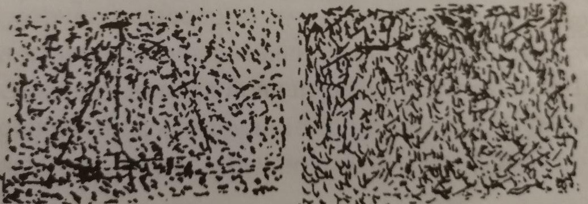
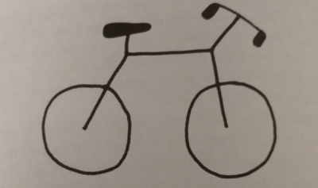

# Недоверчивые умы. Чем нас привлекают теории заговоров
Автор: Бразертон Роб

Интересная книга, основанная на психологических исследованиях. 
Но надо было бы её прочитать до [Максимального репоста](/max_repost.md), а не после. Она скучнее читается, но всё же.

Основная суть книги - все (!), абсолютно все люди подвержены или могут быть подвергнуты влиянию тех или иных теорий заговоров. 
Это естественное продолжение нашего мышления, основанного на умении выявлять связи между явлениями и объектами.
>Мы наделены врожденной подозрительностью. По своей природе мы все конспирологи.

Много, слишком много для русского человека, посвящено убийству Кеннеди. Это случилось в США и многочисленные конспирологические теории обошли нас стороной.
Поэтому из контекста не всегда сразу понятно, о чём там речь. Но и сказать, что это сильно мешало, тоже нельзя. Постепенно все равно становилось все понятно.

В начале книге описывается эксперимент, где людей просили распознавать рисунки на картинках. 
На некоторых они были заложены (кораблик на картинке слева), на некоторых - нет. 
И обнаружили, что в зависимости от контекста больше или меньше людей находили рисунки там, где их не было.

Контекст задавался противоречивыми утверждениями, ровнотой почерка в текстах, волнением перед экзаменом, а также, например, наведением порядка на столе. 
>Противоречивость опасна для нашего стремления к порядку, поэтому в качестве компенсации мы можем начать искать порядок в другом месте

>Экзистенциальная тревога побуждает нас искать другие способы удовлетворить нашу потребность в упорядоченности и контроле, и, если мы не можем контролировать собственную жизнь,
>мы решаем, что ею управляет кто-то - или что-то - еще. Психологи называют это компенсацией потребности контроля.
К компенсации контроля относятся вера в могущественного союзника или, наоборот, сильного врага. 

Теории заговора были всегда. И в книге есть исторический обзор заговоров. Упомянаются и Нерон, и иллюминаты.
Удивлен, что в настоящее время (2020 год, корона-истерия, 5G, анитваксы) до сих пор никто всерьез не возродил протоколы сионских мудрецов.
Там же объясняется вообще всё! ))

В качестве вреда от теорий заговора приводится пример антивакцинаторов, а также погромов и революций.

Много посвящено заговорам вокруг 9.11.2001.

> FalseFlag. Под ложным флагом... Сейчас так называют любые случаи, когда страна наносит удар по своим же гражданам, представляя это так, будто напал кто-то другой, 
> используя нападение как предлог для каких-либо гнусных целей, например, введения драконовских законов или объявления войны

Не обошли стороной и тему бесконечный ресурсов и идеального планирования у заговорщиков. 
Если заговору был, то там точно все прошло без сучка и задоринки, идеально, все нужные ресурсы были. 
Но не совсем идеально, нестыковочки-то бывают. Вот за ними и охотятся конспирологи.

Ещё запомнилось исследование, в котором людям давали две противоречащие друг-другу теории заговора и оказывалось, что большинство верят сразу в обе.

Поразило: люди думают, что знают больше, чем они знают на самом деле. 
Опыт с дорисовыванием велосипеда показал, что многие некорректно нарисовали цепь, не учли поворачиваемость руля и проч.
Хотя предварительно большинство участников оценивали свои знания устройства велосипеда как очень высокие.

Запомнилось стремление людей подводить большие причины под большие события. 
Масштаб события должен соответствовать масштабу причины. 
И обычно это так (атомная бомба в результате целого манхэттенского проекта), но если нет, то это прекрасная почва для теорий заговоров.
Ощущается как: Ну не может целая мировая эпидемия начаться из-за обычного вируса. 
Или не может мировая война развязаться из-за обычного покушения.

Интересно исследование, показывающее ошибку соразмерности. Игроки бросали кубик. И чем большее число им нужно было, тем сильнее они его кидали. 
Хотя, очевидно, сила броска не влияла на результат :)

В другом исследовании люди сравнивали описание вымышленных событий с разными окончаниями. Например, взрыв в грузовом отсеке самолета и попытки пилота посадить его. 
Успешная и неуспешная. В случае успешной больше людей соглашались с более простыми объяснениями взрыва, таким как неисправность электрооборудования. 
А в случае неуспешной попытки посадить популярность получали версии теракта и некомпетентности техников.
И хотя попытка посадить самолет больше зависит от действий пилота, чем от взрыва, но... Важному результату требуется важная причина.

Конечно же, конпсирологи больше других кричат про "мужество пользоваться собственным умом". Для меня эта тема осталась нераскрытой. 
Как отличить накрученную теорию заговора от настоящей? Байесовский метод из [Гарри Поттера и методов рационального мышления](/hpmor.md)? 
Смотреть, для какой гипотезы в реальности меньше противоречий? 
Но в "Недоверчивых умах", в самой же книге, в конце рассказывается о предвзятости подтверждений - неосознанный поиск и создание доказательств, подкрепляющих наш вывод, 
и игнорирование опровергающих фактов. 

> Источники новостей, которые мы читаем, ссылки, по которым переходим в интернете, взгляды людей, которые нас окружают как в общении онлайн, так и в жизни, - все это 
> во многом сответствует тому, во что мы уже верим. Мы воздвигли вокруг своих представлений крепость из подтверждающей информации, почти не выходим оттуда 
> и даже в окно не выглядываем

На одну и ту же ситуацию люди "с разных сторон баррикад" будут смотреть по-разному. Каждая сторона увидит подтверждения своим взглядам. 

К сожалению, безошибочного категоризатора теорий заговора и настоящих событий нет. 
Например, в уже упомянуто книге [Максимальный репост](/max_repost.md) приводились примеры реальных историй, которые по всем характеристикам подходят под теории заговоров:
- ЦРУ в 1950-х испытывало психоделик LSD в качестве "сыворотки правды"
- Прививки могут быть операций прикрытия спецслужб, чтобы добыть ДНК ваших детей - именно таким способом ЦРУ выслеживало (и выследило) бен Ладена в Пакистане
- ФБР может следить за вами через веб-камеру ноутбука

Моё мнение, что по новостям и сообщениям можно по косвенным признакам понять, что скорее всего теория - фейк, но высокой степени достоверности не достигнешь.

> Сначала возникают наши убеждения, затем мы придумываем для них обоснование. 
> Высокий интеллект или возможность получить дополнительную информацию не снижают восприимчивость к ошибочным мнениям. 
> Зато иногда помогают объяснить неудобные факты.

Но без предвзятости подтверждений мы бы не могли существовать. Погрязли бы в сомнениях и неуверенности из-за обилия информации в нашем мире.
Поэтому, насколько я понял, и вера в теории заговора является естественным продолжением нашей способности мыслить.

И пытаться переубеждать кого-то - бесполезно, судя по всему.

Всем заинтересованным, тем кто имеет мужество пользоваться собственным умом (хахахахах), рекомендую прочитать обе книги: и Недоверчивые умы, и Максимальный репост.
Если же выбирать из двух, то Максимальный репост.
