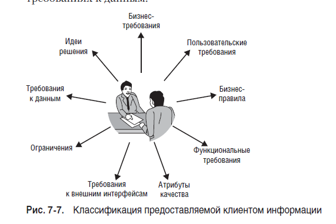

# Разработка требований к ПО. Карл Вигерс.
К ПО, Карл!

2013. Software Requirements, 3rd Edition (with Joy Beatty). Microsoft Press. ISBN 978-0-7356-7966-5

Уффф. Дочитал-таки эту книгу. Осилил за 3 месяца, то есть читать начала еще в 2019. Монументальный труд. Читал его второй раз в жизни.
Теперь уже обращал больше внимания на пункты про управления требованиями и процессы. 
В первый же раз акцент делал на выявлении и сборе требований.

Книга, конечно, уже устаревает. Но все равно, пищи для размышлений там хватает.

Добавляю сюда подчекнутые фразы. И, возможно, свои мысли.

Вот этой классификации информации, как мне кажется, достаточно для прохождения тестовых заданий на 99% процессов собеседованиий.

>Цель разработки требований — накопить требования, которые позволят проектировать приложения с приемлемым уровнем риска.

>Требования - это спецификация того, что должно быть реализовано. В них описано поведение системы, свойства системы или ее атрибуты.
>Они могут служить ограничениями в процессе разработки системы.

>Требования охватывают как видение
>пользователя, так и внешнее поведение системы, а также представление разработчика о некоторых внутренних характеристиках

>В конечном счете все модели врут, но некоторые оказываются полезными

>Характеристика (feature) — это набор логически связанных функциональных требований, которые представляют ценность для пользователя и
>удовлетворяют бизнес-цели.

>Чтобы снизить количество «бантиков», отслеживайте каждый элемент функциональности до его источника, чтобы четко понимать, почему именно он включен в продукт.

>Задача аналитика — собрать и проанализировать мнения заинтересованных сторон и лиц, отразить их в спецификации требований и передать информацию другим заинтересованным в проекте лицам.

>Задача аналитика — прежде всего выяснить, для чего нужна пользователям новая система, и затем определить пользовательские, функциональные и качественные требования, на основе которых команды смогут оценить и спланировать проект, а также спроектировать, построить и проверить продукт.

>Бизнес-аналитик должен обеспечить, чтобы бизнес-требования определяли правильные заинтересованные лица и организовать сбор, приоритизацию и разрешение конфликтов

>Укажите все известные критичные требования к качеству или интерфейсам, но не упоминайте особенности реализации и дизайна.

>Убедитесь, что они оценивают то, что важно для бизнеса, а не просто то, что легко оценить

В рамках и ограничения проекта >Вам необходимо указать, что может делать система, а что не может.

>Но в первом выпуске важно не забыть о нефункциональных требованиях.

>Переделка архитектуры для исправления недостатков качества может стоить столько же, сколько написание продукта с нуля

>Заинтересованными в проекте лицами (stakeholders) называются отдельные группы или организации, которые активно вовлечены в проект, на которых влияет результат проекта и которые сами могут влиять на этот результат

>Укажите, когда пользователям в разных местах нужен доступ к системе

>прозрачность важнее догматичного соблюдения всех правил для создания «правильной» диаграммы.

>Проект готов, когда критерии успеха указывают, что у вас хорошие шансы удовлетворить бизнес-цели.

>Вовлечение клиентов в работу над проектом — единственный способ избежать разрыва ожиданий

>Чтобы было легче внедрить идею с классами пользователей в жизнь, стоит описать типичного представителя каждого класса, или архетип (persona) пользователя

>в наиболее успешных проектах всегда больше каналов общения вообще и тех, что напрямую связывают разработчика и клиента, чем в менее успешных проектах

>Ничто не заменит наличие правильных людей, в правильной роли, в правильном месте и с правильным отношением.

>Выявление требований — совместный и аналитический процесс, включающий такие действия, как сбор, обнаружение, извлечение и определение требований.

>Концентрация на задачах пользователей, а не на интерфейсе, внимание к ключевым потребностям, а не к пожеланиям позволяет команде преждевременно не отвлекаться на детали архитектуры.

>Людям намного проще давать замечания и критиковать материал, чем создавать новый.

>Когда вы разрабатываете приложение, призванное заменить текущую унаследованную версию системы, попросите пользователей назвать три вещи, которые раздражают их сейчас в системе больше всего

>В конце встречи поинтересуйтесь: «Есть ли что-либо еще, о чем я должен был спросить?»

>Также держите под рукой наклейки для заметок и маркеры. Предложите другим участникам вставать с места и тоже делать заметки — такая организация позволяет вовлечь людей в процесс

>Функциональные требования описывают ожидаемое поведение системы при определенных условиях и действия, которые система позволит выполнять пользователям

>Поинтересуйтесь причинами ограничений, проверьте, насколько они аргументированы, и задокументируйте обоснование для включения этого ограничения в качестве требования.

>Правило одинаково для обеих ситуаций, однако функциональные требования к ПО — действия, предпринимаемые системой, если бизнес-правило встречается в ходе работы — различаются в зависимости от рабочей среды системы

>Итог разработки требований — задокументированное соглашение между заинтересованными лицами о создаваемом продукте.

>Помните, что требования пишутся для определенной аудитории.

>Не стоит рассчитывать, что телепатия и ясновидение заменят собой надежные приемы разработки спецификаций требований. Они попросту не работают, хотя некоторые упорно пытаются использовать в качестве основы проектов разработки ПО.

>Если нужной функциональности или качества нет в соглашении о требованиях, нет оснований ожидать, что они появятся в продукте

>Требования, которые включают или написаны в форме идей по решению, а не потребностей накладывают ограничения на дизайн, часто неоправданные, поэтому за этим надо следить.

>спецификация подразумевает постепенное уточнение подробностей на правильном этапе проекта, что является хорошей практикой в любом про-
екте.

>Выбор надлежащих форм спецификации требований к ПО — исключительная прерогатива команды проекта

>Рекомендуется записывать автора каждого требования, чтобы узнать, кто его высказал, если будет обнаружен конфликт.

>Качество требований определяет читатель, а не автор

>Использование моделей для улучшения коммуникации между участниками проекта важнее догматического соблюдения этих правил.

>Зачастую проблему легче обнаружить, если идти назад от наиболее детализированного уровня и рассматривать большую картину, которую предоставляют модели анализа.

>Удобство и простота использования измеряется усилиями, требуемыми для подготовки ввода данных, эксплуатации и вывода конечной
информации

>Мы не рекомендуем пользоваться MoSCoW.
