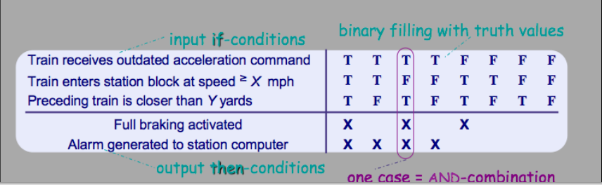

SRS Documents: Requirements and Diagrammatic Notations
https://www.coursera.org/learn/srs-documents-requirements

Nodes:
- Для сложных комбинаций различных условий рекомендуют использовать таблички. Нагляднее и понятнее.

