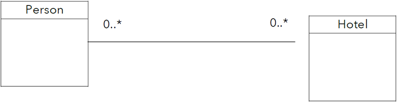
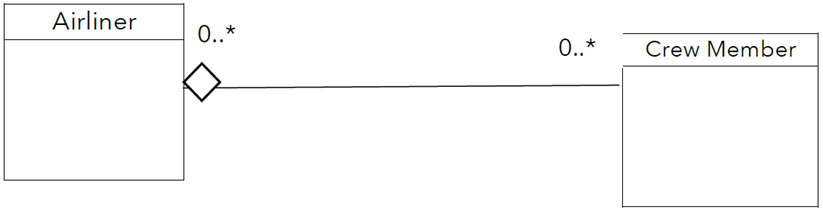
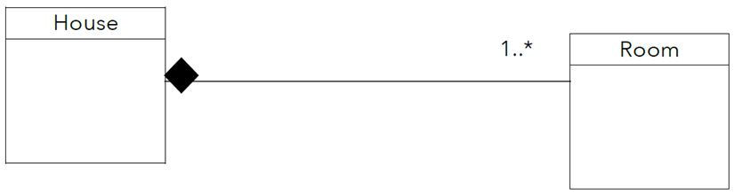
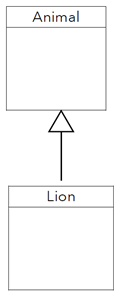
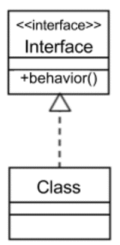
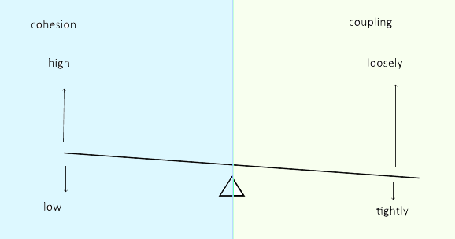
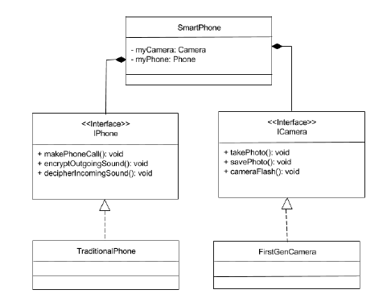
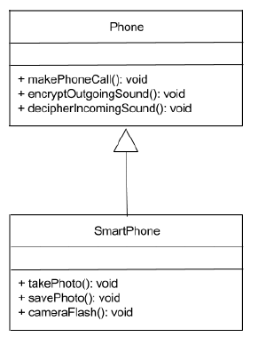
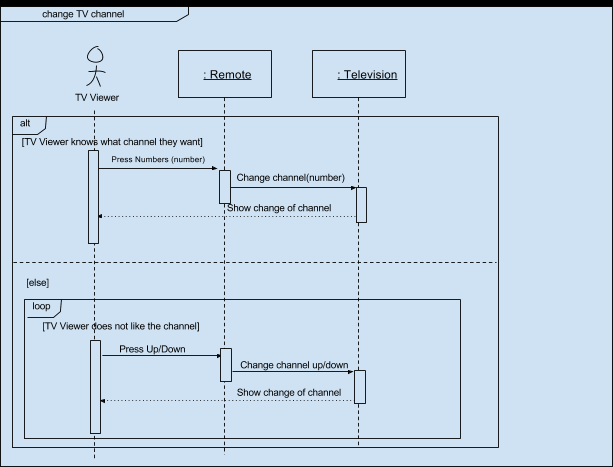

# Название и ссылка
[Объектно-ориентированное проектирование (Object Oriented Design)](https://www.coursera.org/learn/object-oriented-design)

# Общее мнение
Курс очевидно начального уровня. Вводит в объекто-ориентированное проектирование (или дизайн, по ихнему). Инкапсуляция, наследование, полиморфизм - вот это вот все.
Мне лично он был полезен, как вспоминание основ и закрепление терминов. Не путать абстракцию с агрегацией, и всё такое. 
Пригодится перед следующим курсом этой специализации, уже по нормальному проектированию.
Ну и один-два хинта, которые может быть где-то пригодятся. И сертификат прибить к линкедину, который формально покажет девочкам из hr, что я "саморазвиваюсь".

# Чуть более детальный обзор
Файл с заметками к курсу доступен тут: [Course notes.pdf](/files/Course notes.pdf)

Де-юро курс состоял из 4 модулей. Но де-факто модулей было 3. Последний - проверочный. 
Каждый модуль на неделю. Но обычно модуль занимал у меня 2-3-4 недели.

MODULE 1: OBJECT-ORIENTED ANALYSIS AND DESIGN
MODULE 2: OBJECT-ORIENTED MODELLING
MODULE 3: DESIGN PRINCIPLES
MODULE 4: Capstone Challenge

Пройдемся тут по первым трём модулям в их порядке.

### MODULE 1: OBJECT-ORIENTED ANALYSIS AND DESIGN
* Объекты мы встречаем в природе. Они имеют свойства и поведения с ответственностями
* ООП позволяет коду оставаться структурированным, гибким и сохраняет возможность переиспользования
  + Структурированность - всегда понятно, где искать детали объектов и функции
  + Гибкость. Модульность. Изменения вносятся в объект без прямого влияния на другой код.
  + Переиспользование. Сокращает и упрощает код
  
> Примечание: это всё известно с ранних 90х. Хнык

Процесс разработки итеративный: выявленные проблемы -> набор требований -> концетуальные дизайн макеты -> технический дизайн диаграммы -> внедрение -> тест

Дизайн (проектирование) – это всегда торговля между различными атрибутами качества: производительность, поддерживаеомсть, надежность, безопасность и т.п.

Смотрят, как атрибуты качества будут достигаться в различных ситуациях при выбранном дизайне.
Не забываем про контекст. И про масштабирование. Например, для малых объемов что-то работает, а для больших – уже не будет.

Приводят технику CRC Cards (Class, Responsibility, Collaborator) - техника (понятно, что одна из), которая позволяеот отразить на верхнем уровне компоненты, ответственности и связи, сформированные на этапе концептуального дизайна. 
Простой доступный способ с возможностью редактировать, как говорят нам авторы курса. 
Главное достоинство – физически «почувствовать» дизайн. Помогает выявлять недостатки. 
Можно играться с порядком карточек и щупать дизайн. 
А также понимать связи между элементами.

> Примечание: мне так и осталось непонятным, зачем они вводили эти  CRC Cards. Все преимущества этой "техники" покрываются диаграммой классой в UML или ER-диаграммой
> Видимо, как переходный этап от нуля к этим диаграммам.

### MODULE 2: OBJECT-ORIENTED MODELLING
4 кита, на которых держится OOM (the four major design principles used in object-oriented modelling):
* **Abstraction** – представление концета в виде упрощенного описание, игнорируя неважные детали и подчеркивая необходимые основы с учетом контектсов.
Следует придерживаться **принципа наименьшего удивления**: правило предлагает что атрибут и поведение должны быть реализованы без сюпризов и не иметь смыслов, выходящих за рамки. 
По сути, абстракция – это выявление классов, их ответственностей, атрибутов и методов. 
При этом, это все далется наиболее релевантным образом с учетом контекста. 
Принципы абстракции помогают упростить проект классов, так что классы более сфокусированны, лаконичны и понятны для читателя. 
Важно понимать, что при изменении цели системы или решаемой проблемы нужно пересматривать абстракции на предмет релевантности новому контексту.
* **Encapsulation** – упаковка в «капсулы». К некоторым есть доступн извне, к другим – нет. 
Три идеи:
  + Связь значений атрибутов и функций, работающих с ними, в виде объектов, содержащих их внутри
  + Интерфейсы для данных и функций
  + Ограничение доступа к данным и функциям только изнутри объекта
Инкапсуляция позволяет определить релевантные к контексту поведения и свойства объектов и связывать их в одних и тех же классах. 
Можно создавать отдельные экземпляры объектов из классов с собственными значениями атрибутов и поведением. 
Это значительно упрощает разработку.
Также тут целостность и защита данных. 
И также повышает переиспользуемость из-за мышления как о черном ящике. 
* **Decomposition** – разбивка целого на части, которые вместе и образуют целое. 
Помогает за счет облегчение понимания отдельных частей. 
Основное правило – смотреть на общие ответственности целого и оценивать, как можно разбить на части так, чтобы каждая часть имела выделенную ответственность.
Части также можно делить на части. 
Пример: Дом – Кухня – Холодильник
Также необходимо судить о жизненном цикле. 
Жизненный цикл отдельной части может прекращаться вместе с жизнью целого, а может и не прекращаться.  
* **Generalization** – помогает бороться с избыточностью при решении задач. 
Например, методы – это пример обощения. 
Методы позволяют применять поведение к различным входным данным. 
Нет необходимости иметь одинаковые куски кода по всей программе. 
ООП достигает обобщения классов за счет наследования. 
Вынос общего поведения или характеристик в отдельные классы. 
Родительские классы (суперклассы) и классы-дети (сабклассы). 
Без родительских классов код системы не будет гибкой, управляемой и переиспользуемой. 
Родительские классы экономят время и предотвращают ошибки.

Эти принципы помогают в решение проблем и помогают разрабатывать гибкое, переиспользуемое и управлеяемой ПО.

Дизайн (в смысле проектирование) предполагает многократное итеративное перемещение из пространства проблемы в пространство решений и обратно.

Давно разработали ООП (объекто-ориентированно проектирование). Это эффективный способ проектирования, но могут быть задачи, для которых лучше подходят другие парадигмы.
* Концептуальный дизайн использует ООП для выявления основных объектов и разбивки задачи на управляемые части. Тут пойдут и CRC-cards, как говорят авторы курса.
* Технический дизайн использует ООП для дальнейшей детализации объектов, их атрибутов и поведения. Помогает разработчикам.
Технический дизайн более удовлетворяет диаграмма классов UML. Тут больше деталей и легче конвертировать в классы в коде.

Дальше посмотрим, как 4 основных принципа (те 4 кита) ложаться на UML.
#### Abstraction
Здесь нечего сказать. Сам факт выделения объектов и отрисовки их на диаграммах и есть абстракция

#### Encapsulation
UML Class diagram – в каждой сущности задаем три блока: 
+ Class name, 
+ properties (<variable name>:<variable type>), 
+ operations (<name>( <parameter list> ) : <return type>)

Пример класса:
Student     |
:--------   |
-gpa: float<br>-degreeProgram: String |
+getGPA(): float<br>+setGPA( float )<br>+getDegreeProgram(): String<br>+setDegreeProgram( String )  |


#### Decomposition
Три типа отношений, определяющих взаимодействие целого и частей:
* **Association** – два объекта независимы друг от друга и просто взаимодействуют. 
Если один объект «умирает», другой продолжает существовать. 
Любое число объектов во взаимодействии. 
Один объект не принадлежит другому. Пример: человек – отель.



* **Aggregation** - is a “has-a” relationship. 
Целое владеет частями. 
Части могут разделяться между целыми в этом отношении. 
Слабое отношение. 
Хотя части могут и принадлежать целому, они могут и существовать независимо от него. 
Пример: самолет и экипаж. 
Самолет не сможет предлагать сервис без экипажа. 
Тем не менее, самолет не перестанет существовать без экипажа. 
Аналогично и экипаж.


Пустой ромб определяет целое в этом отношении двух объектов.

* **Composition** – is a strong “has-a”. 
Целое не может существовать без своих частей. 
И если целое уничтожается, то уничтожаются и части тоже. 
Обычно в таком отношении доступ к частям возможен только через целое. 
Пример: дом – комната. 


Ромб определяет целое.


#### Generalization
Выделение общих повторяемых характеристик у нескольких классов. Наследование.



Абстрактый объект не может быть создан.
Типы наследования в Java:
* Implementation inheritance
* interface inheritance. Вместо multiple inheritance в C++

>A Java interface also denotes a type, but an interface only declares method signatures, with no constructors, attributes, or method bodies. polymorphism.




### MODULE 3: DESIGN PRINCIPLES
* Оценка сложности с учетом связанности и сплоченности (coupling and cohesion)
* Разделение интересов (the separation of concerns)
* Сокрытие информации (Information Hiding)
* Концептуальная целостность
* Принципы обобщения

Гайды для убеждения, что ПО гибкое, переиспользуемое, управляемое. 

Также покрывает моделирование поведения объектов. UML State Diagram и UML sequence diagrams.

Модуль – классы и их методы

Нужна оценка сложности дизайна. 
Хороший дизайн позволяет любым модулям соединяться без больших проблем. 
Или другими словами, модули совместимы друг с другом и могут переиспользвоаться

В качетсве метрик для оценки дизайна часто используются coupling and cohesion
##### Coupling
**Coupling** (сцепленность)– фокусируется на сложности между разными модулями. 
От слабой сцепления (loosely coupled) до сильного сцепления (tightly coupled). 
Если модуль сильно зависит от другого, это сильное сцепление. Это плохой дизайн.   
А если модуль легко связать с другими с помощью хорошо определенных интерфейсов, это слабая сцепленность с другими. Это хороший дизайн.  
Для оценки сцепленности в свою очередь используют степень, простоту и гибкость.
  + Степень – это количество связей между модулем и другими модулями. 
  Их должно быть мало. 
  Например, модуль должен связываться с другими с помощью нескольких параметров или узких интерфейсов.
  + Простота – это насколько очевидны связи между модулем и другими. 
  Связи должны быть достаточно простыми для создания без необходимости понимания реализации других модулей.
  + Гибкость отображает насколько заменяемы другие модули для этого модуля. Другие модули должны легко заменяться на что-то лучшее в будущем.
  
Признаками сильного сцепления и плохого дизайна:
* Модуль связан с другими через огромное количество параметров и интерфейсов
* Отсылки одного модуля к другому сложно найти
* Модуль может быть связан только с некоторыми специфичными другими модулями и не может быть заменен
##### Cohesion
**Cohesion** – сплоченность фокусируется на сложности внутри модуля. 
И представляет ясность ответсвенностей модуля. Лежит между high cohesion and low cohesion.
Модуль, который выполняет одну задачу и ничего больше, или который имеет явную понятную цель, имеет высокую сплоченность. Это признак хорошего дизайна.  
С другой стороны, если модуль скрывает более 1 цели, если все сложно понятть методы, или если цели не ясны – это низкая сплоченность. Признак плохого дизайна.   
Если у модуля больше одной ответственности, надо бы его разбивать.
Важно держать баланс low coupling and high cohesion в дизайне. 
Но бывает, что сложность может быть размазана между модулями или в модулях. 
Например, модули упрощены для достижения high cohesion, могут зависеть больше от других модулей, что повышает Coupling. 
С другой стороны, если упрощать связи между модулями для достижения низкой Coupling, может понадобиться дать больше ответственностей в модуль, что снизит cohesion.

> Для себя сам изобразил так



#### Разеделние интересов
Для декомпозии нужен принцип разделения интересов (of separation of concerns). 
Concern – что-то знамое с т.з. дизайна системы. 
Различные консерны лучше держать отдельно. В различных частях ПО. 

Независимость секций. Можно одну обновить, не зная про другие как они работают. 
И изменения можно делать только в одном модуле.
Оказывается, это ключевая идея объектно-ориентированного моделирования и программирования. 
>When addressing concerns separately, more cohesive classes are created and the design principles of abstraction, encapsulation, decomposition, and generalization are enforced:

##### Пример
Вот есть у нас смартфон. Он умеет звонить и фотать. Пусть для него вначале создан класс:  
```java
public class SmartPhone {
  private byte camera;
  private byte phone;
  
  public SmartPhone() { … }
  
  public void takePhoto() { … }
  public void savePhoto() { … }
  public void cameraFlash() { … }
  public void makePhoneCall() { … }
  public void encryptOutgoingSound() { … }
  public void decipherIncomingSound() { … }
}
```
Тут у нас low cohesion, потому что внутри класса поведения, которые не связаны друг с другом.
Поведение камеры не нуждается в инкапсуляции вместе с поведением телефона для того, чтобы камере делать свою работу.
Также тут нет никакой модульности. Например, невозможно получить доступ отдельно к камере и отдельно к телефону.
Если одна система билдится, то должна билдиться и другая. 
Камеру, например, хрен заменишь другой камерой или другим объектом без удаления кода камеры полностью из этого класса.  

Используя разделение интересов, можем понять, что класс SmartPhone нуждается в двух интересах:
* Звонить по телефону
* Делать фоточки встроенной камерой

Теперь, когда мы выделили интересы, можно разделить их по своим собственным классам.
Собственные классы будут более сплоченными (more cohesive).
Получится инкапсуляция. Независимые интересы в независимых классах.



Атрибуты и поведения телефона и камеры разделены по двум различным интерфейсам.
Каждый имплементируется через соответствующий класс:
```java
public interface ICamera {
  public void takePhoto();
  public void savePhoto();
  public void cameraFlash();
}

public interface IPhone {
  public void makePhoneCall();
  public void encryptOutgoingSound();
  public void deciphereIncomingSound();
}

public class FirstGenCamera implements ICamera {
  /* Abstracted camera attributes */

public class TraditionalPhone implements IPhone {
  /* Abstracted phone attributes */
}
```  

Код класса Смартфон теперь будет такой:
```java
public class SmartPhone {
  private ICamera myCamera;
  private IPhone myPhone;

  public SmartPhone( ICamera aCamera, IPhone aPhone ) {
    this.myCamera = aCamera;
    this.myPhone = aPhone;
    }
  
  public void useCamera() {
    return this.myCamera.takePhoto();
  }

  public void usePhone() {
    return this.myPhone.makePhoneCall();
  }
}
```

Вот и все. Класс SmartPhone по-прежнему предоставляет функции телефона и камеры.
Но телефон и камера разделены по отдельным классам, их функциональность спрятана друг от друга, но они все еще aggregated under the SmartPhone class.
Конструктор класса SmartPhone принимает камеру и телефон как параметры.
Стало возможно создать новую сущнсоть SmartPhone с помощью передачи на вход сущности классов, которые реализуют интерфейсы ICamera и IPhone.
Кто создает соответствующие объекты камеры и телефона - это уже отделенная ответственность. И классу SmartPhone не нужно этого знать. 
Ну и наконец, класс SmartPhone имеет методы, которые форвардят ответственность за использование камеры и телефона в соответствующие объекты.

Вот он модульный дизайн. В будущем можно легко заменить классы камеры или телефона на что-то еще. И не трогать при этом класс SmartPhone вообще, совсем, т.е. полностью.

Класс SmartPhone теперь более сплоченный (more cohesive). 
При этом увеличена сцепленность (increased coupling), потому что класс SmartPhone должен знать об интерфейса Камеры и Телефона и косвенно зависит от других классов.

В этом примере для разделение интересов было использовано:
* Разделение понятний камеры и телефона через обобщение (generalization) и определение двух интерфейсов;
* Разделение функций камеры и телефона с помощью применения абстракции (abstraction) и инкапсуляции (encapsulation) и определения двух реализующих классов;
* Применения декомпозиции (decomposition) к Смартфону, таким образом составлюящие части были выделены из целого
---

#### Сокрытие информации
Сокрытие информации - один из концептов доступа к информации.
Модули должны иметь доступ только к информации, которая нужна им для выполнения своей работы.
Сокрытие информации - это ограничение доступа до минимума информации, которая нужна для правильного использования модулей, и сокрытие всего остального.
Скрывается не только чувтсвительная информация, но и изменяемые детали, такие как алгоритмы и представления данных. При этом, предположения часто выносятся в API.
Вещи, которые могут меняться, должны быть скрыты. А вещи, которые не изменятся, должны быть в интерфейсах. 

В java есть модификаторы доступа:
* Public - доступны любым модулем в системе. Другие классы смогут получать и изменять эти атрибуты. Или доступы к методам (но не менять их поведение).
* Protected - доступны только внутри класса и sub-классам и классам из того же пакета. Пакет в java - это единый namespace
* Default - доступны подклассам и классам из того же пакета или инкапсуляции. Не нуждается в объявлении. Поэтому часто называют "no modifier access"
* Private - не доступны никому, кроме инкапсулированных внутри класса.

#### Концептуальная целостность (Conceptual Integrity)
Это концепция единых принципов проектирования и соглашений, нужных для одновременной работы над системой несколькими людьми. 
И чтобы система продложала оставаться согласованной, связанной и последовательной, как если бы над ней работал 1 человек.

Для достижения этих целей используют:
* общение
* code reviews 
* соглашения о design principles and programming constructs
* хорошо определнный дизайн или архитектуру, лежающую в основе системы
* унифицирование концепций
* выделенная небольшая группа, имеющая доступ к каждому коммиту в код

> "It is better to have a system omit certain anomalous features and improvements, but to reflect one set of design ideas, than to have one that contains many
> good but independent and uncoordinated ideas"
> Fred Brooks, The Mythical Man-Month

#### Принципы обощения (Generalization Principles)
В целом хорошо следовать 4 принципам: abstraction, encapsulation, decomposition, and generalization.
Но еще лучше следовать им хорошо. 

Если принципы проектирования использовать неправильно, они могут создать проблем больше, чем решать.

Наследование (Inheritance) отличная техника. Но если её использовать неправильно, можно сделать еще хуже (can lead to poor code). 

Пара принципов обощения:
1. Задавать вопрос "Я использую наследование, чтобы просто делиться атрибутами и поведением, не привнося ничего нового в subclasses?".
Если ответ "да", то лучше наследование не использовать, потому что нет никаких оснований для существования подклассов. Достаточно суперкласса.

Например: работник - общий тип для менеджеров, продажников, финансистов, но каждый из этих подклассов работников выполняет определенные функции. 
Наследование может иметь смысл в этом случае. 
Но если, например, создается несколько различных видов пиццы, и на самом деле нет никакой специализации между разными видами пиццы, то подклассы не требуются.

2. Другой принцип - определить, не нарушен ли Принцип подстановки Барбары Лисков (Liskov substitution principle, LSP). 
Этот принцип гласит, что подкалсс может заменить суперкласс тогда и только тогда, когда подкласс не меняет функциональности суперкласса (во всяком случае так говорится в курсе).
Это означает, что если подкласс заменяет суперкласс, но полностью меняет все поведения суперкласса, то наследование было использовано неправильно или зря.

Например, если класс Кит, у которого есть поведение "плавать", заменяется классом Животное, такие функции как "бегать" и "ходить" будут переписаны. 
Класс Кит больше не ведет себя так, как ожидалось от его суперкласса, нарушая принцип Барбары Лисков.

В тех случаях, когда наследование не применимо, можно использовать декомпозицию. 
Вернемся к примеру со Смартфоном.  



В этом примере не имеет смысла использовать наследование от традиционного Телефона к Смартфону и затем добавлять методы камеры к подклассу Смартфон.
Вместо этого, декомпозиция помогает выделить ответственности Камеры в её собственный класс. 
Это позволяет классу Смартфону предоставлять ответственности камеры и за телефона через отдельные классы без знания, как они работают.


Хотя наследование - это мощный принцип, важно точно знать, когда использовать эту технику. Иначе существует риск добавления проблем в код.


### Specialized UML class diagrams
Видимо, в конце решили поговорить про диаграммы UML. Как они могут улучшить этап технического дизайна.
Я хз, что о них писать особо. Просто приведу примеры

#### UML Sequence Diagrams
Помогает улучшить ясность и дизайн программ.



#### UML State Diagrams
Помогает выделить условия, которые не планировались. 
Также помогает прочекать полноту и корректность тестов.


### Model Checking
Также важны техники по верификации системы: юнит-тесты, бета-тестинг, симуляции. 
Одна из техник - Проверка моделей, заключающаяся в систематической проверки системы во всевозможных состояниях её State Model.
И утверждается, что эта техника может выявить ошибки, которые другими техниками не выявляются.

Симулируются различные события, которые могут менять состояния или значения переменных в системе.
Обычно Model Checking выполняется на этапе тестирования системы с помощью специального ПО.

Например, вообразите, что в системе есть правило не доводить до дедлока. 

>Deadlock is a situation where the system cannot continue because two tasks are waiting for the same resource

Model Checker будим симулировать различные состояние, которые могут возникать в системе, и если дедлок все же где-то возможен, предоставит детали этого бага.

Моделеру на вход подается модель состояний. Моделер проверяет, что модель состояний подходит под соответствующие поведенческие свойства. 
Например, моделер может проверить модель состояний на недостатки такие как race conditions (зависимость от порядка выполнения частей кода при параллелилизме), исследуя все возможные состояния вашей модели.

Три различные фазы в проверке моделей:
1. Фаза моделирования (modelling phase). Модель описывается на том же языке, что и сама система. Также на этой фазе выполняются простые понятные ясные проверки (sanity checks) с простой логикой. 
Нужны, чтобы на следующих фазах уже думать о более сложной логике.
2. Фаза выполнения (running phase). Моделер запущен и проверяет, как модель удовлетворяет желаемым свойствам, описанным на предыдущей фазе.
3. Фаза анализа (analysis phase). Эта фаза наступает тогда, когда все желаемые свойства проверены и найдены некоторые нарушения. 
Нарушения называются контрпримерами (counterexamples). Model Checker должен предоставить описания нарушений, чтобы можно было их анализировать.

Model Checker запускается повторно до тех пор, пока все не будет корректно работать. 

Model Checking не только помогает убедиться, что система хорошо спроектированна, но также помогает понять, удовлетворяет ли система желаемым качествам и поведению, и работает так, как задумано. 


