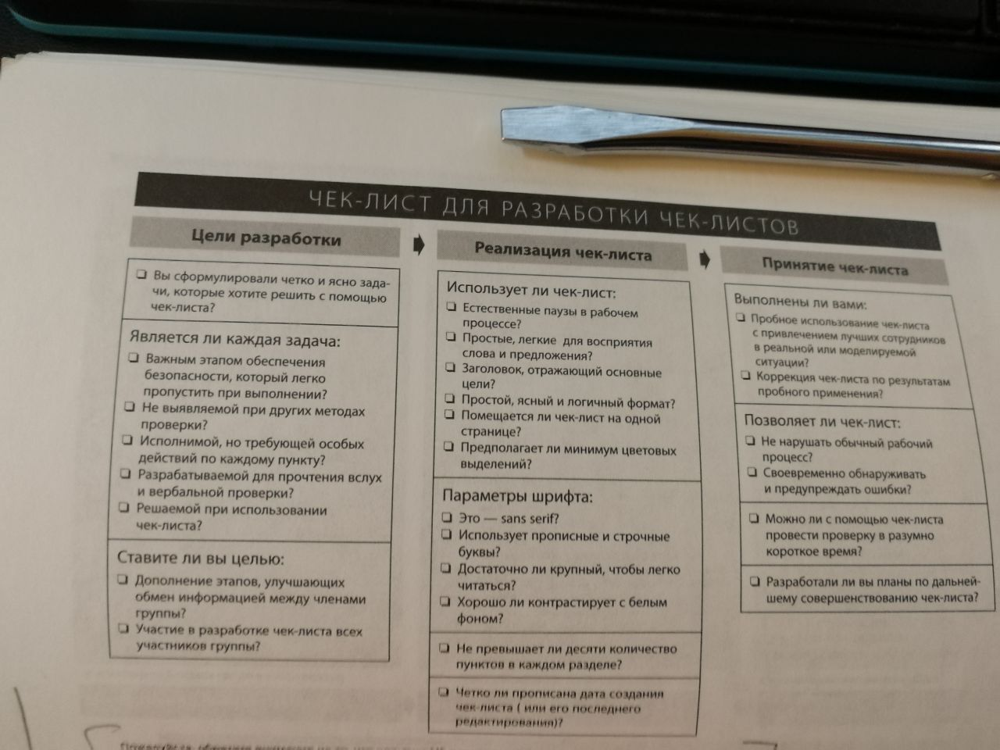

---

description: "Книга Атула Гаванде о применении чек-листов в медицине и других сложных областях для предотвращения ошибок"
keywords: ["чек-листы", "ошибки", "медицина", "Атул Гаванде", "безопасность"]

---
# Чек-лист. Как избежать глупых ошибок, ведущих к фатальным последствиям
**Автор:** Атул Гаванде

# Перед прочтением

1. Понять, что можно полезного извлечь из чек-листов
2. Сравнить опыт своих чек-листов с другими
3. Посмотреть, чем книга так понравилась школе системного мышления

# После прочтения

Чек-листы - это шанс спастись от ошибок. Их позаимствовали из авиации. Автор - медик. И внедрял чек-листы в медицине, в хирургии.

Эффект его поразил. Одним из неожиданных для меня эффектов от внедрения - улучшение коммуникации внутри команды.

Автор в полном восторге от чек-листов. Мне же кажется, что не одни они работают. Да и чек-листы имеют свои ограничения. Быстро исчерпывают свои возможности, наверно. Доводят до какого-нибудь уровня, а для дальнейших улучшений нужно уже что-то другое.

Но, безусловно, чек-листы полезны для избегания “примитивных” ошибок и для слаженности действий в сложных и экстренных ситуациях.

Эффективно разгружают голову от рутины, что-ли, для решения других задач. При этом, не заменяют собой регламенты, инструкции, учебные пособия, алгоритмы и прочее. В чек-листах не нужно все расстолковывать.

## Цитаты

> Если бы все решали инженеры, то все здания были бы прямоугольными коробками

> Многообразие и сложность строительной индустрии на всех этапах значительно превосходили возможности одного человека

> Если нельзя предвидеть все проблемы, то можно хотя бы предусмотреть, где и когда они могут возникнуть

> Перед лицом неизвестности, когда нет уверенности в том, что в сложных ситуациях все пойдет как надо, строители рассчитывали на силу коммуникации

> Человеку свойственно ошибаться. Но коллектив реже допускает ошибки

> “Говорушка” - за полчаса до открытия кухни сход сотрудников для обсуждения неожиданностей и рабочих проблем

> Для стимулирования использования мыла Safeguard вложили листовки с инструкциями, где перечислили 6 ситуаций, когда человек обязан использовать мыло. Люди стали использовать мыло более систематически.

> При таком множестве дел, которые сваливаются на врачей, когда пациента везут в операционную, именно о таких вещах никто и не вспоминает (_про простейшие задачи_)

> Кроме того, это было знаком, что хирург не может начать операцию до того, как получит разрешение от медсестры, которая должна была снять пирамидку. Это было равносильно маленькому культурному сдвигу

> “Это не моя проблема” - пожалуй, худшее, что могут подумать люди перед началом операции, во время выруливания заполненного пассажирами самолета на взлетную полосу или строительства 300-метрового высотного здания. Но в медицине мы сталкиваемся с этим повсеместно.

> Чтобы бригада достигла наилучших результатов... необходимо, чтобы ни одно действие не провалилось в “щели” между профессиями и чтобы вся команда оставалась коллективом даже при возникновении очень сложных ситуаций

> Люди, которые не знают друг друга по имени, не могут работать слаженно

> Есть хорошие чек-листы и плохие. Плохие написаны расплывчато и неточно. Хорошие чек-листы, наоброт, отличаются большой точностью. Они эффективны, конкретны и просты в использовании даже в сложных ситуациях. В них не делается попытка перечислить все - чек-листы не умеют пилотировать. В них перечислены только наиболее важные действия

> Функциональность чек-листов ограничена. Они могут напомнить экспертам о том, как управлять сложным процессом или настроить сложную машину, позволяя четче распределить приоритеты и стимулировать коллективные действия людей

> Сами по себе чек-листы не могут никого принудить к их выполнению

> Человеческая память и суждения несовершенны

> Чек-листы бывают: “СДЕЛАЙ-ПОДТВЕРДИ” или “ПРОЧТИ-СДЕЛАЙ”

> По неписанному правилу в чек-лист входит от 5 до 9 пунктов (про чек-листы в боинге)

> Хотя эти операции очень важны, опыт показывает, что профессиональные пилоты практически никогда не делают в них ошибок, поэтому их не стоит включать в чек-листы

> Чек-листы - это быстрые и эффективные инструменты, позволяющие мобилизировать весь опыт профессионалов

> В авиации есть правило, согласно которому летчик, пилотирующий самолет, не начинает работу с чек-листом. Более того, он объявляет всем о распределении ответственности, и с этого момента каждый член экипажа, а не только командир воздушного судна, отвечает за благополучие полета и имеет право голоса наравне с другими

> Хоторнский эффект - т.е. полученными нами результаты есть следствие не использования чек-листа, а повышенного интереса к проблеме

> Главное было создать культуру коллективной работы и укрепить дисциплину

> От них [летчиков-испытателей] требовались концентрация, отвага, ум и способность к импровизации, что и составляло “нужную вещь”. Однако по мере расширения знаний о том, как контролировать риски пилотирования, т.е. по мере внедрения и усложнения чек-листов и тренажеров опасность работы летчиков-испытателей уменьшилась, и первостепенное значение приобрели такие понятия, как безопасность и добросовестность

> Мы не любим чек-листы. Они могут отнимать много сил. Они скучны. Но я не думаю, что ими пренебрегают из-за лени... Они не соответсвтуют нашим представлениям о великих людях, которыми мы стремимся стать, и о том, как они ведут себя в сложных ситуациях, когда на кону большие ставки. Великое требует отваги. Великие люди импровизируют. Им не нужны протоколы и чек-листы. Может, нам стоит пересмотреть наши представления о героизме?

> Мы не созданы для дисциплины. Нам нравятся новизна и восторг, а не тщательное отношение к деталям

> ... Основную часть времени все эти процедуры казались лишенными смысла...

> ... 49 раз из 50 это ничего не дает, но на сей раз сработало...

> Чек-лист избавляет человека от бездумных действий, от той рутины, которой не должен заниматься его мозг, позволяя ему уделять внимание более сложным делам

> Однако первым пунктом в чек-листе идет потрясающая формулировка “Продолжайте пилотирование”. _(чтобы пилот не забывал о своей главной задаче, пытаясь снова запустить двигатель)_
> ...Увеличить шансы людей на выживание...

> В большинстве случаев нам кажется, что проблемы решаются лишь тогда, когда мы больше работаем

## Чек-лист для разработки чек-листов

