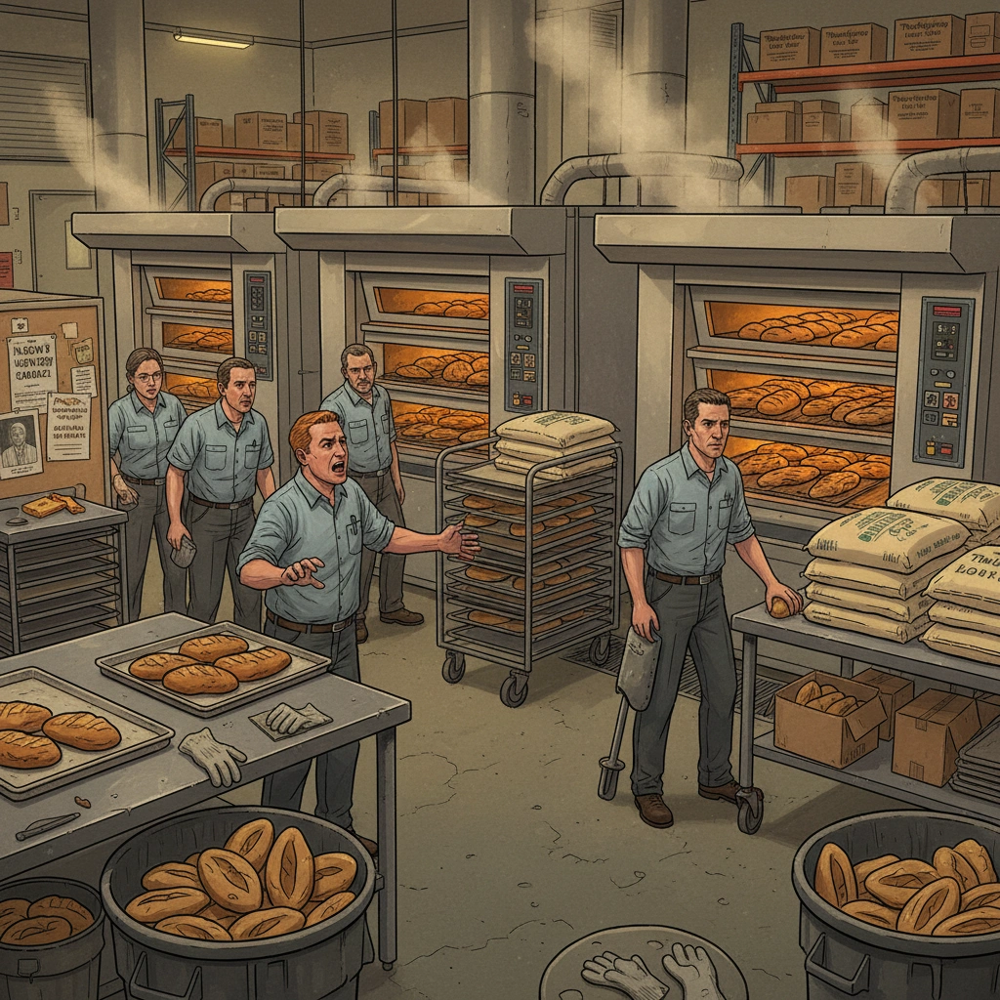

# Решение проблем по методам спецслужб
**Автор:** Морган Джонс

## Впечатления

Дочитал.

Есть несколько хороших моментов:
- Мне понравилось, как идёт проверка гипотез, отталкиваясь от несоответствия фактам. «Принимается» та гипотеза, которой меньше всего фактов противоречит.
- Подход к оценкам по дереву решений — хотя он очень похож на теорию игр (полезность и вероятность), и меня даже возмутило слишком сильное погружение в банальщину про теорию вероятностей и подсчёт процентов, в целом подход норм. И изменение точки зрения — думать, с какой т.з. я сейчас оцениваю полезность.

Понравилось, что есть упражнения и примеры их решения. Хотя я почти ничего не делал — слишком скучно, и вроде принципы понятны.

Понравилось, что говорят про точки зрения и необходимость их двигать.

Возможно, что-то когда-то даже смогу применить в работе.

## Цитаты



Все мы крайне склонны фокусироваться на выбранном мнении



Участие в анализе альтернатив кого-то из собеседников в роли адвоката дьявола просто необходимо

Режим дивергентного мышления

Здравый смысл — во многих случаях это законы, по которым работает человеческая память и по которым сознание обрабатывает информацию

Мозг (то есть разум) не оснащён «блоком оценки вероятностей»



Жизнь — это просто череда ситуаций, в которых приходится делать выбор



Мы должны научиться тому, что умеют делать профессиональные актёры: на время и правда становиться другим человеком и после такого перевоплощения тщательно анализировать

Разбить задачу на элементы, причём так, чтобы можно было сфокусироваться на каждом из них по отдельности и проанализировать каждый системно и эффективно

Смотреть на задачу с полной объективностью крайне сложно ещё и в силу особенностей человеческого разума



Завышение или занижение вероятности исхода, который в наибольшей степени соответствует нашим намерениям, — типичный результат самообольщения: со мной этого не случится, потому что я этого не хочу



Как только мы в ходе анализа переходим от строгих фактов к оценочным суждениям, всякая определённость заканчивается — и начинаются вероятностные оценки

Повторяемость — это частота появления определённого события в прошлом
(*прим.: тут меня позабавила задача с вероятностью открыть 5 дверей, где после открытия первой увеличивается вероятность открыть вторую*)

В книге приводится подробный (порой даже излишне) алгоритм проверки гипотез, состоящий из 8 шагов:

Шаг 1: сформулировать гипотезы
Шаг 2: построить матрицу
Шаг 3: перечислить в левой колонке существенные факты и доказательства
Шаг 4: двигаясь слева направо, по горизонтали, проверить соответствие фактов каждой из гипотез.
    Рассматривая факты поочереди, определите, являетсяли факт соответствующим (С), противоречащим (П) или неоднозначным (Н) по отношению к каждой из гипотез
Шаг 5: доработать матрицу
    А. Добавить гипотезы или перефразировать существующие
    В. Добавить в таблицу все дополнительные «существенные» доказательства и факты, связанные с добавленными гипотезами или с новыми версиями прежних гипотез, и снова протестировать взаимосвязь между фактами и каждой из гипотез.
    С. Вычеркнуть из матрицы, но переписать на отдельный лист факты и доказательства, которые соответствуют всем рассматриваемым гипотезам: они не представляют никакой ценности для дальнейшего анализа и сравнения гипотез
Шаг 6: оценить поочередно каждую из гипотез, двигаясь сверху вниз по перечню.
    Вычеркните все гипотезы, которым ваши факты серьезно противоречат. Еще раз оцените и перепроверьте достоверность противоречащих гипотезам фактов. Сформулируйте и также проверьте на достоверность все основные предположения, на которые вы опирались.
Шаг 7: из оставшихся гипотез составить рейтинг, используя в качестве критерия степень влияния противоречащих фактов. Гипотеза с минимальным числом противоречащих ей фактов должна считаться наиболее вероятной.
    мы не просто суммируем количество П для каждой из гипотез — ведь степень несоответствия фактов может быть разной, и это необходимо выяснить. Собственно, в этом и есть смысл анализа.
Шаг 8: оценить, насколько разумны сделанные выводы

Приведу здесь упражнение 13 из книги. Для удобства я сжал его и кратко описал метод. Во второй вкладке привожу полный текст, если вдруг заинтересует.



- Краткое описание {selected}

  > Накануне Дня благодарения — в самый горячий сезон — на пекарне, выпускающей хлеб по спецрецептам для розничных сетей, три партии хлеба подряд вышли из печей пересушенными или сгоревшими.

  > Мастер проверил термодатчики и оборудование — всё исправно. Директор Уиллис сразу заподозрил саботаж: незадолго до этого он уволил популярного сотрудника Менендеса и отказал профсоюзу в расширении соцпакета.
  >
  > Пекарей двух пострадавших бригад — Ферни и Бобби — он считал возможными зачинщиками, тем более что Бобби открыто выражал недовольство, а Ферни помогал собирать членов профсоюза.
  >
  > Начальник производства Свенсон в саботаж не верил и искал техническую причину. Пекарь второй бригады Франк Моро, которого видели разговаривающим с уволенным Менендесом на парковке, объяснил: датчики в порядке, а если бы скакало давление в газопроводе, сгорели бы все партии во всех печах.
  >
  > Новый поставщик привёз муку с небольшим опозданием, но это не объясняло брак. Причина происшествия так и оставалась неясной.

- Полное описание

  За несколько дней до Дня благодарения, в разгар самого активного торгового сезона, руководство пекарни, где делается хлеб по специальным рецептам для нескольких розничных сетей, столкнулось с проблемой: хлеб начал выходить из печей либо пересушенным, либо вообще сгоревшим. Отгружать его покупателям было нельзя.

  Хлеб выпекается тремя бригадами рабочих, каждая из которых работает с четырех часов вечера до полуночи. Каждая бригада готовит тесто и выпекает хлеб в пяти больших печах, которые загружаются по мере готовности теста. Печь одновременно выпекает партию в 50 буханок. Каждая бригада выпекает за смену десять таких партий. На производство партии уходит пять часов: четыре часа тесто замешивается, вымешивается и поднимается, и один час уходит на выпечку. В течение первых пяти часов смены каждая бригада раз в час закладывает в печь новую партию. Бригада, выходящая на работу в полночь и работающая до восьми утра, упаковывает хлеб для последующей доставки в супермаркеты.

  Тед Свенсон, начальник производства, узнал о проблеме в 11 вечера: ему позвонил Фернандо Родригес, пекарь бригады 1, и начал страшно ругаться. Свенсон выскочил из кабинета и бросился в цех, где Родригес и семеро членов его бригады лихорадочно доставали поддоны с хлебом из печей и выбрасывали содержимое в мусорные баки.

  — Что тут творится, Ферни?
  — А сам не видишь, что творится? — закричал в ответ пекарь. Лицо его было красным от ярости. — Все сгорело! Весь хлеб! Все пятьдесят буханок!
    — А в чем дело?
    — Черт меня побери, если я знаю. Печь нагрета до трехсот пятидесяти градусов, как положено, и, когда мы час назад поставили сюда поддоны, тесто выглядело совершенно нормально.

    Ванда Парнелл, заведующая складом, услышала шум и тоже вышла из кабинета, чтобы посмотреть, что стряслось. Она в буквальном смысле почувствовала, что пахнет жареным, и, будучи представителем профсоюза пекарей, предпочла лично разобраться в проблеме.
    — Может, термостат не работает? — предположил Свенсон. — Я позвоню в сервисную компанию и попрошу, чтобы они кого-нибудь прислали. Это какая печь, третья?
    — Да, — ответил Ферни, продолжая вместе со своей бригадой доставать поддоны горелого хлеба и швырять их на металлические столы. — У меня такого раньше не случалось. Никогда!

    Свенсон похлопал его по плечу:
    — Да не волнуйся ты так. Все бывает в первый раз. Будем считать, что это полезный опыт. — И, прежде чем уйти, добавил: — Сообщите мне, что скажет мастер. А пока давайте эту печь выключим. Раз она капризничает, надо с ней быстрее разобраться. Нельзя же накануне Дня благодарения сорвать поставки.

    Как только Свенсон вошел в кабинет, ему из соседней комнаты крикнул Генри Уиллис, директор пекарни:
    — Эй, Тед, что там стряслось?
    — Да ничего страшного, Ферни сжег партию хлеба.
    — Не похоже на него, — ответил Уиллис. — А в чем там дело?
    — Не знаю. Вызовем мастера, чтобы проверил термостат печи. Я тебе расскажу, когда что-нибудь выяснится.
    — А вы печь остановили?
    — Ага, пока не выясним, в термостате ли дело.
    — С заказами проблем не будет?
    — Не должно. Даже если термостат испорчен, мы же заменим его за десять минут — и через двадцать минут печь будет работать.
    — Ну хорошо, — ответил Уиллис, — держи меня в курсе.
    — Обязательно.

    Через 25 минут приехал мастер, проверил термостат и сообщил, что он исправен. Уиллис, Свенсон и Родригес быстро обсудили ситуацию и решили заново разогреть печь и попробовать испечь новую партию.

    После полуночи в кабинет Свенсона заглянула Ванда Парнелл:
    — Тед, пойдем-ка, тебе надо это увидеть!
    — А что? — Свенсон поспешил за Вандой в цех.
    — Первая бригада сожгла еще одну партию, а теперь и у третьей бригады похожие проблемы, хотя у них хлеб не совсем сгорел.

    Они пробежали мимо зоны, где Ферни со своими ребятами снова вытряхивали сгоревший хлеб в мусорные баки. В зоне третьей бригады Бобби Ленхам, пекарь, стоял над поддонами с хлебом из четвертой печи, спрятав руки за спину и молча качая головой.
    — Что случилось, Бобби? — спросил Свенсон.
    — Передержали. Не знаю, как это вышло. Ферни сжег две партии, а теперь вот и у меня случилось почти то же самое. Хлеб, конечно, не совсем сгорел, но слишком сухой, в магазины его отправлять нельзя. Выбрасываем?
    — Ну, видимо, да, — ответил Свенсон без особой радости.

    Тут к ним подошел Уиллис.
    — Еще одна испорчена? — Он печально смотрел на темно-коричневые буханки.
    — Уже три, — ответил Свенсон, кивая в сторону зоны, где работала бригада Ферни.
    — Три! Да что тут творится, черт возьми? — По выражению его лица и тону можно было догадаться, что он не очень-то верит в то, что это просто досадная случайность.

    Все посмотрели на Уиллиса: удивление на лицах сменилось выражением обиды и даже возмущения.
    — Мы пока не знаем, — ответил Свенсон, — но должны разобраться как можно быстрее. — Он направился к кабинету. — Я позвоню мастеру. Что-то же должно быть не так с этими печами. Может, давление газа скачет? Давайте обе печи отключим, и не включайте пока третью у первой бригады: вначале нужно разобраться.

    Двадцать минут спустя Уиллис вошел в кабинет Свенсона, сел на стул.
    — Не нравится мне все это, Тед. Совсем не нравится. Что-то тут не так. Опытные пекари не могут случайно пересушить партию, а уж тем более три.
    — Думаешь, это чье-то вредительство?
    — Даже не думаю, а прямо утверждаю!
    — Это невозможно! Ни Ферни, ни Бобби никогда такого не сделают.
    — Да ну? Бобби — горячая голова и за последние несколько недель ясно дал понять, что не доволен тем, как я тут управляю. А с Ферни они лучшие друзья.

    С этим сложно было поспорить: в последние две недели Уиллису действительно пришлось провести сложные переговоры с профсоюзом работников пекарен относительно нового контракта. И всего два дня назад во время встречи с Уиллисом и Свенсоном Ванда Парнелл представила требования профсоюза относительно серьезного расширения социального пакета для сотрудников, включая увеличение продолжительности оплачиваемого отпуска по болезни. Уиллис стоял насмерть и категорически отказывался увеличивать выплаты, утверждая, что компания просто не может себе этого позволить.

    Уиллис продолжил:
    — И когда же еще устраивать подобные провокации, как не накануне Дня благодарения? Будь у меня доказательства, я бы обоих уволил.
    — Должно быть другое объяснение, — ответил Свенсон.
    — Например?
    — Ты же прекрасно знаешь, как печется хлеб. Может, стеллажи в печи застревают и не вращаются? Или напряжение в вентиляторах скачет, дрожжи плохие, еще какие-то ингредиенты негодные? Да мало ли всего, что пекарь на глаз оценить не может.
    — Ну хорошо, давай рассуждать. С тех пор как я две недели назад уволил Хуана Менендеса за пьянство на работе, Бобби ходит весь напряженный, как натянутая струна. А ведь я Хуана трижды поймал на пьянстве. Два раза предупреждал, а на третий раз не выдержал. Бобби все ворчит, что доказательств у меня нет, кровь на анализ у Хуана я не брал — как будто я полицейский и арестовал Менендеса за вождение в нетрезвом виде, но вот в трубку дунуть его не попросил и права не зачитал. Тут у нас бизнес, а не полицейский участок. И я в состоянии отличить пьяного от трезвого. А Бобби всех уже взбаламутил этой историей, включая и команду Ферни.
    — Ладно, насчет Ферни ты прав, — ответил Свенсон. — Он действительно несколько раз говорил со мной насчет Менендеса, хотя всегда вежливо, с разумными доводами, не как Бобби.
    — А разве Ферни не помогал Бобби собрать в выходные членов профсоюза и обсудить соцпакет? Помнишь, что один из ребят из первой бригады сказал тебе в понедельник?
    — Помню — что профсоюз выбьет новые условия любой ценой.
    — Вот именно. И я не удивлюсь, если вторая бригада тоже сейчас сожжет партию: у членов профсоюза это называется солидарностью!
    — Да ну, брось, Генри. Франк Моро? Ни он, ни его бригада такого не сделают. Франк как раз против профсоюзов.
    — Однако он туда вступил! — ответил Уиллис, подняв палец.
    — Франк мне все объяснил: ему пришлось вступить, чтобы добиться слаженной командной работы в бригаде.
    — Чушь! Я был пекарем десять лет и никогда не считал, что мне нужно вступать в этот идиотский профсоюз.
    — Времена теперь другие.
    — А ты знаешь, что Менендес был тут вчера?
    — Нет! Где?
    — А там, за пекарней, на парковке. И угадай, с кем он говорил?

    Свенсон пожал плечами.
    — С Франком Моро. И что ты думаешь об этом их рандеву?

    Свенсон помолчал; он был крайне удивлен. Потом поднялся:
    — Пойду проверю печи. Там сейчас мастер работает. И с Франком обо всем этом поговорю.
    — Пока ты там, — ухмыльнулся Уиллис, — спроси его, как его нога.
    — Нога? А что с ногой?
    — Говорит, что уронил на ногу мешок муки утром, когда принимали товар от нового поставщика. Перелома нет, но хромал сильно… или притворялся. Может, еще заявление напишет на компенсацию.

    Свенсон бросил на Уиллиса недобрый взгляд и вышел.

    Он нашел Франка в зоне работы второй бригады: тот проверял температуру в печах.
    — Что думаешь, Франк? Датчики дурят?
    — Нет, мастер только что закончил. Датчики в порядке, и вентиляторы, и стойки исправны. А если бы проблема была с давлением в газовых трубах, то сгорели бы все партии во всех печах.
    — А как твоя нога?
    — Да не очень. Чертовы мешки! Я помогал Ванде с разгрузкой сегодня утром. Обычно она, конечно, развозит все по складу на погрузчике, но вчера в конце смены Бобби сорвался на нее, потому что не оказалось муки. День благодарения на носу, а у нас ведь мешок на две партии: странно, что запасы не закончились еще раньше. Поэтому я ей помог растащить мешки сразу к зонам работы бригад, чтобы у всех был запас на весь день.
    — И что, что-то не так?
    — Да нет, но бросать такую вот малышку себе на ногу не советую: в ней сорок пять кило. А поставщик все привез вовремя — на пару дней всего опоздал. — Моро засмеялся. — Уиллис решил, что задержку поставки устроил профсоюз? Типа поговорили с кем надо?

    Свенсон покачал головой и ухмыльнулся:
    — Да нет, конечно.

    Но он знал, что Моро был прав: Уиллис подозревал, что профсоюз тут поучаствовал.
    — Да конечно, так он и считает, — запальчиво сказал Моро. — Но тут ведь все просто: мы, как всегда, использовали все запасы подчистую и потом только бросились заказывать. Вчера к концу смены у меня оставалось два мешка из прошлой партии, у Бобби было полтора, у Ферни один. Я видел, как Уиллис бегал по кабинету с телефоном в руке и кричал в трубку на поставщика: он же понимал, что работа может вообще остановиться. Наверное, думал, что мы специально все истратили, чтоб ему навредить.
    — Но его сложно винить, — возразил Свенсон. — День благодарения же на носу, а это самый горячий сезон.
    — Ну, наверное, да. Однако настрой тут у нас что-то не очень. Не думаю, что бригады сильно переживали бы за Уиллиса, закройся мы на день-два.
    — Это ты о чем? — Свенсон был потрясен. В словах Моро слышалась открытая угроза.
    — Я о том, что народ недоволен. Их соцпакет хуже, чем в других пекарнях.
    — И ты встал на сторону профсоюза?

    Моро нахмурился:
    — А при чем тут профсоюз? Я думал, мы говорим о настроениях наших сотрудников. Люди хотят получить то, на что, как им кажется, имеют право. А профсоюз это использует — как и всегда. Ты знаешь, я против профсоюзов, но факты остаются фактами. Уиллису пора бы очнуться, а то получит настоящие проблемы. А он Менендеса уволил и этим только все усложнил.
    — Народ действительно расстроен из-за истории с Менендесом? — поинтересовался Свенсон.
    — Еще бы, его тут все любили. А еще он был старше многих, и молодежь считала его кем-то вроде покровителя. Уиллису следовало бы это понимать.
    — Я слышал, Менендес вчера заходил. Ты с ним говорил?
    — А если бы и говорил, что это меняет? — ответил Моро с вызовом.
    — Зависит от того, о чем вы говорили.
    — Ну, я тебе так скажу: мы просто поговорили. Ничего особенного.
    — А еще с кем-то он говорил?
    — Слушай, Тед, я тебе не доносчик. Хочешь узнать — спроси их. — Моро резко отвернулся и занялся печами.

    Свенсон посмотрел на часы: без четверти час. И быстро пошел к Уиллису.



## Описание алгоритма проверки гипотез



- Кратко {selected}

  В столбцы выписываем все свои гипотезы, в строки — факты и доказательства, которые у нас есть. В ячейке на пересечении пишем С, если факт соответствует гипотезе, П — если противоречит, и Н — если факт является неоднозначным. Ещё раз мудрым ленинским прищуром смотрим на таблицу, добавляем гипотезы и факты. Получается что-то вроде такого:

  | **Факты** | **Саботаж со стороны сотрудников** | **Неполадки газомера печей** | **Скачки давления в газопроводе** |
  |-----------|-----------------------------------|------------------------------|-----------------------------------|
  | Три партии хлеба пересушены или подгорели | С | С | С |
  | Подгорел только хлеб, произведенный по специальному рецепту | С | С | С |
  | Хлеб подгорел только в двух печах | С | С | П |
  | Мастер не нашел неисправностей в работе термодатчиков | С | П | С |
  | Проблема проявилась в самый напряженный период года | С | С | С |
  | Сотрудники крайне недовольны новым соцпакетом | С | С | С |
  | Сотрудники недовольны увольнением Менендеса | С | С | С |
  | Франка Моро (пекаря бригады 2) видели разговаривающим с Менендесом на парковке | С | С | С |
  | Новый поставщик привез муку с опозданием | С | С | С |

  Из таблицы вычеркиваем факты и доказательства, которые соответствуют всем нашим гипотезам: они не помогают нам дифференцировать гипотезы, поэтому бесполезны.

  Остаётся такая таблица:

  | **Факты** | **Саботаж со стороны сотрудников** | **Неполадки газомера печей** | **Скачки давления в газопроводе** | **Новая мука оказалась бракованной** |
  |-----------|-----------------------------------|------------------------------|-----------------------------------|--------------------------------------|
  | Хлеб подгорел только в двух печах | С | С | П | С |
  | Мастер не нашел неисправностей в работе термодатчиков | С | П | С | С |
  | Пересушенными оказались только те партии, тесто для которых замешивали на новой муке | П | П | П | С |

  В целом в кандидаты на верную, то есть неопровергнутую, гипотезу выходит та, у которой меньше П.

  Но нужно ещё и ещё думать, насколько каждая П сильна по отношению к гипотезам и насколько полно мы охватили гипотезы и факты.

- Подробно

  Пройдём по 8 шагам алгоритма проверки гипотез.

  

  - Шаг 1: сформулировать гипотезы

    В книге на первом шаге выделили три гипотезы:

    - Саботаж со стороны сотрудников
    - Неполадки газомера печей
    - Скачки давления в газопроводе

  - Шаг 2: построить матрицу

    Аж целый шаг выделили под это. Штож, строим матрицу.

    | **Факты** | **Саботаж со стороны сотрудников** | **Неполадки газомера печей** | **Скачки давления в газопроводе** |
    |-----------|-----------------------------------|------------------------------|-----------------------------------|
    |  |  |  |  |

  - Шаг 3: перечислить в левой колонке существенные факты и доказательства

    В левую колонку таблицы в книге на шаге 3 записали девять фактов. Факты брали из полного описания задания. Сразу же, что удивительно, одним шагом добавили эти факты в таблицу:

    | **Факты** | **Саботаж со стороны сотрудников** | **Неполадки газомера печей** | **Скачки давления в газопроводе** |
    |-----------|-----------------------------------|------------------------------|-----------------------------------|
    | Три партии хлеба пересушены или подгорели |  |  |  |
    | Подгорел только хлеб, произведенный по специальному рецепту |  |  |  |
    | Хлеб подгорел только в двух печах |  |  |  |
    | Мастер не нашел неисправностей в работе термодатчиков |  |  |  |
    | Проблема проявилась в самый напряженный период года |  |  |  |
    | Сотрудники крайне недовольны новым соцпакетом |  |  |  |
    | Сотрудники недовольны увольнением Менендеса |  |  |  |
    | Франка Моро (пекаря бригады 2) видели разговаривающим с Менендесом на парковке |  |  |  |
    | Новый поставщик привез муку с опозданием |  |  |  |

  - Шаг 4: двигаясь слева направо, по горизонтали, проверить соответствие фактов каждой из гипотез

    Рассматривая факты поочереди, определите, является ли факт соответствующим (С), противоречащим (П) или неоднозначным (Н) по отношению к каждой из гипотез.

    Таблица приобретает такой вид:

    | **Факты** | **Саботаж со стороны сотрудников** | **Неполадки газомера печей** | **Скачки давления в газопроводе** |
    |-----------|-----------------------------------|------------------------------|-----------------------------------|
    | Три партии хлеба пересушены или подгорели | С | С | С |
    | Подгорел только хлеб, произведенный по специальному рецепту | С | С | С |
    | Хлеб подгорел только в двух печах | С | С | П |
    | Мастер не нашел неисправностей в работе термодатчиков | С | П | С |
    | Проблема проявилась в самый напряженный период года | С | С | С |
    | Сотрудники крайне недовольны новым соцпакетом | С | С | С |
    | Сотрудники недовольны увольнением Менендеса | С | С | С |
    | Франка Моро (пекаря бригады 2) видели разговаривающим с Менендесом на парковке | С | С | С |
    | Новый поставщик привез муку с опозданием | С | С | С |

  - Шаг 5: доработать матрицу

    **А**. Добавить гипотезы или перефразировать существующие.

    В книге лирический герой заметил, что проблема с подгоревшим хлебом возникла в день первой поставки муки от нового поставщика. Возможно, эти события связаны? Если так, то нужно рассмотреть еще одну гипотезу: «Новая мука оказалась бракованной».

    **В**. Добавить в таблицу все дополнительные «существенные» доказательства и факты, связанные с добавленными гипотезами или с новыми версиями прежних гипотез, и снова протестировать взаимосвязь между фактами и каждой из гипотез.

    В книге лирический герой заметил новый факт: пересушенными оказались только те партии, тесто для которых замешивали на новой муке.

    | **Факты** | **Саботаж со стороны сотрудников** | **Неполадки газомера печей** | **Скачки давления в газопроводе** | **Новая мука оказалась бракованной** |
    |-----------|-----------------------------------|------------------------------|-----------------------------------|--------------------------------------|
    | Три партии хлеба пересушены или подгорели | С | С | С | С |
    | Подгорел только хлеб, произведенный по специальному рецепту | С | С | С | С |
    | Хлеб подгорел только в двух печах | С | С | П | С |
    | Мастер не нашел неисправностей в работе термодатчиков | С | П | С | С |
    | Проблема проявилась в самый напряженный период года | С | С | С | С |
    | Сотрудники крайне недовольны новым соцпакетом | С | С | С | С |
    | Сотрудники недовольны увольнением Менендеса | С | С | С | С |
    | Франка Моро (пекаря бригады 2) видели разговаривающим с Менендесом на парковке | С | С | С | С |
    | Новый поставщик привез муку с опозданием | С | С | С | С |
    | Пересушенными оказались только те партии, тесто для которых замешивали на новой муке | П | П | П | С |

    **С**. Вычеркнуть из матрицы, но переписать на отдельный лист факты (на всякий случай) и доказательства, которые соответствуют всем рассматриваемым гипотезам: они не представляют никакой ценности для дальнейшего анализа и сравнения гипотез.
    После вычеркивания таблица стала такой:

    | **Факты** | **Саботаж со стороны сотрудников** | **Неполадки газомера печей** | **Скачки давления в газопроводе** | **Новая мука оказалась бракованной** |
    |-----------|-----------------------------------|------------------------------|-----------------------------------|--------------------------------------|
    | Хлеб подгорел только в двух печах | С | С | П | С |
    | Мастер не нашел неисправностей в работе термодатчиков | С | П | С | С |
    | Пересушенными оказались только те партии, тесто для которых замешивали на новой муке | П | П | П | С |

  - Шаг 6: оценить поочередно каждую из гипотез, двигаясь сверху вниз по перечню

    Вычеркните все гипотезы, которым ваши факты серьезно противоречат. Еще раз оцените и перепроверьте достоверность противоречащих гипотезам фактов. Сформулируйте и также проверьте на достоверность все основные предположения, на которые вы опирались.

    В книге после этого три из четырех гипотез оказываются опровергнутыми, остается лишь четвертая гипотеза: «Новая мука оказалась бракованной».

    ~~

    | **Факты** | ~~**Саботаж со стороны сотрудников**~~ | ~~**Неполадки газомера печей**~~ | ~~*Скачки давления в газопроводе**~~ | **Новая мука оказалась бракованной** |
    |-----------|-----------------------------------|------------------------------|-----------------------------------|--------------------------------------|
    | Хлеб подгорел только в двух печах | ~~С~~ | ~~С~~ | ~~П~~ | С |
    | Мастер не нашел неисправностей в работе термодатчиков | ~~С~~ | ~~П~~ | ~~С~~ | С |
    | Пересушенными оказались только те партии, тесто для которых замешивали на новой муке | ~~П~~ | ~~П~~ |~~П~~ | С |

  - Шаг 7: из оставшихся гипотез составить рейтинг, используя в качестве критерия степень влияния противоречащих фактов

    Мы не просто суммируем количество П для каждой из гипотез — ведь степень несоответствия фактов может быть разной, и это необходимо выяснить. Собственно, в этом и есть смысл анализа.

  - Шаг 8: оценить, насколько разумны сделанные выводы

    В книге вывод показался разумным.

  



Вот и всё. Как по мне, довольно неплохо структурировано.
