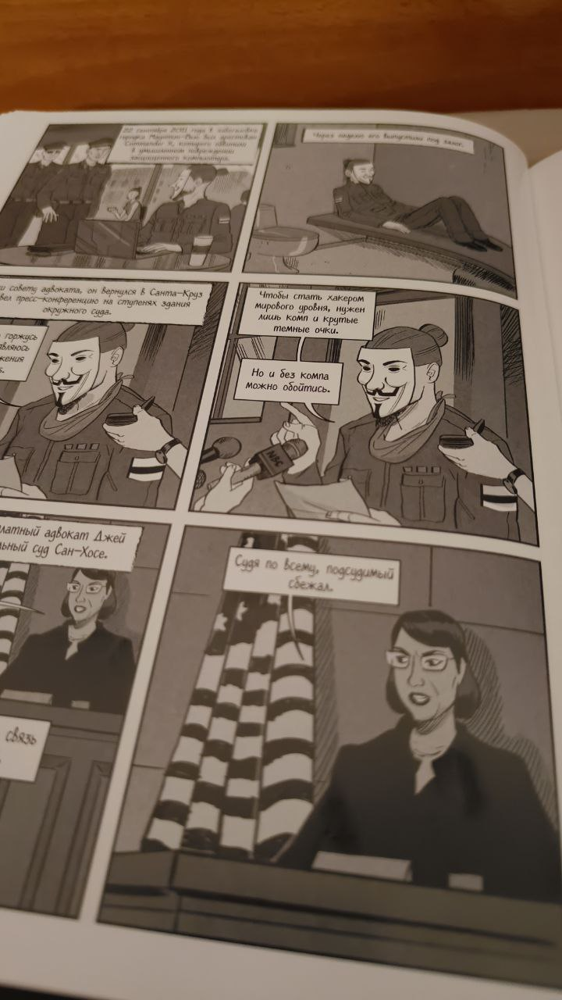

# A – значит Anonymous. Иллюстрированная история хакерской группировки, изменившей мир

**Авторы:**
Дэвид Кушнер,
Корен Шадми

Date: 2024-01-01

Это комикс

# Перед прочтением

1. Хотел подробной истории про группировку по аналогии с [[Киберпреступник №1. История создателя подпольной сетевой]] или [[Вторжение. Краткая история русских хакеров]]

# После прочтения

1. Довольно поверхностно и как-то не полностью покрыто. Несколько событий раскрыли, а остальные - просто перечислили.
2. Больше всего посвятили церкви саентологии
3. Лозунг: имя нам легион (вспоминаем [[Князь мира сего]])
4. Чувак, который хотел не дать заглохнуть расследованию про изнасилование футболистами девочки, в итоге получил двушку, а футболитсы - по году. То есть он получил больше них. За участие в сговоре для взлома сайта школы и дачу ложных показаний ФБР. А вообще хотели дать 25 за мошеничество и злоупотребление с использованием компьютеров, но скостили за чистосердечное
5. Прочитал за пару неспешных часов, а может и того меньше

> 
> Доксинг - поиск и открытая публикация персональной информации о человеке

1. Майк Хант при быстром произношении звучит как моя п..да на английском. Звонили на радио и просили позвать Майка Ханта.

