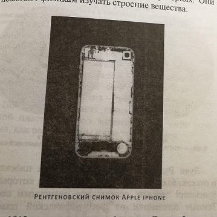

# Солнечное вещество

Автор: М.П. Бронштейн

## Рецензия
Отличная книга советской научпоп школы. Узнал о ней из интервью Зимина - основателя Билайна и фонда "Эволюция". Купил и не пожалел.

Книга небольшая, 188 страниц А5.

Оказалось, что автор был провидцем и уже в 1936 имел ренгеновский снимок айфона. По крайней мере, если опираться на мой печатный экземпляр книиг :))

Очень интересно и понятно рассказывает про спектрографы, про открытие гелия сначала на Солнце, потом на Земле. Рассказыает также о подходах различных учёных, о параллельных открытиях, об ошибках и сопутствующих им открытиях других веществ, о x-лучах и радиосвязи. Объясняет, как определяют возраст Земли и ископаемых. Касается истории использования гелия и водорода в дирижаблях.

Есть картинки спектров разных веществ. Также есть схемы приборов, используемых для извлечения газов.

Почему-то запомнилась семантика названий газов:
1. Гелий - понятно, солнечный, от "Гелиос" (по-гречески Солнце).
2. Аргон - по-гречески значит "ленивый"
3. Криптон - по-гречески значит "скрытый"
4. Неон - по-гречески значит "новый"
5. Ксенон - по-гречески значит "чуждый"

Также несколько цитат:

> Когда физики говорят о том, сколько весит литр какого-нибудь газа, они подразумевают, что этот газ берется при температуре ноль градусов Цельсия и при нормальном давлении (760 мм рт. ст.)

> Чем тяжелее газ, тем медленнее он просачивается через обожженную глину. Этот физический закон открыл английский физик Грэм. Закон Грэма оправдывается и на примере азота с аргоном

> Криптон это гелий. Приезжайте - увидите. Крукс.

> Изо всех газов один только водород легче гелия, а все другие тяжелее. Воздух тяжелее гелия почти в семь раз

> Поиски гелия напоминают мне поиски очков, которые старый профессор ищет на ковре, на столе, под газетами - и находит наконец у себя на носу. Гелий очень долго искали. А он был в воздухе!

> Открытие новой спектральной линии еще не доказывает существование нового вещества

> Владелец одного шляпного магазина в Лондоне даже поместил в газете объявление о том, что у него продаются специальные шляпы из особо плотного материала, непрозрачного для новых лучей

Книга прекрасно дополняет Фейнмана, Китайгородского и другие научпоп книги по физике. Если бы я читал такие книги в 6-7 классе, я бы не смог не стать физиком :)

Книгу рекомендую.
Мне кажется, идеально подойдет для детей 7-9 лет.
