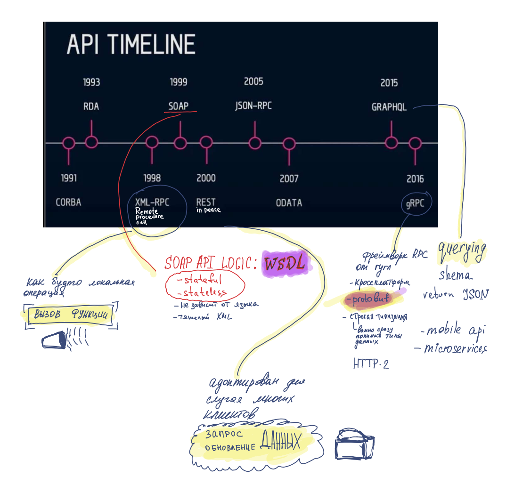

# System design. Подготовка к сложному интервью

**Автор:** Алекс Сюй
**Дата завершения:** 2024-04-14
**Статус:** Finished

**Причины прочитать:** Увидел где-то в блогах

# System design. Подготовка к сложному интервью

# Перед прочтением

1. Научиться проходить секцию дизайна систем
2. Получить обзорное представление об этом

# После прочтения

# Цитаты

Выделяем 4 этапа

1. Понять задачу и определить масштаб
    1. Требования
2. Предложить общее решение и получить одобрение
    1. Начальный план архитектуры - поинтересуйтесь мнением интервьюера, как будто это член команды
    2. Блок схема
    3. Приблизительные расчёты
3. Подробное проектирование
    1. Приоритет компонентов
    2. Углубляться в нужное, не углубляться в ненужное
4. Подведение итогов
    1. Узкие места и улучшения возможные
    2. Краткий обзор архитектуры
    3. Внештатные ситуации: поломка серверов, разрыв сети
    4. Метрики и журналы
    5. Масштабирование. Например, с 1 млн юзеров до 10 млн



Не рассуждайте молча



В целом книга очень полезная, структурирует и дополняет знания.

Прикрепляю свои заметки рукописные, где выделил много интересных вещей.

Из запомнившегося:

- Согласованное хэширование
- Пульсация
- Алгоритмы Rate Limits в запросах на API
- Решение проблемы уникальных IDs

Поисковые саджесты

Протоколы

