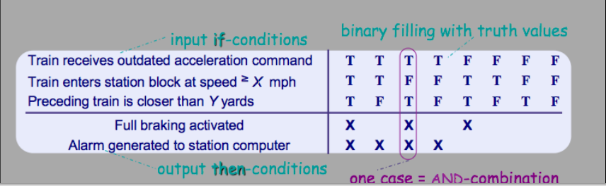

# SRS Documents: Requirements and Diagrammatic Notations

<https://www.coursera.org/learn/srs-documents-requirements>

Курс, имхо, совершенно начального уровня. Для джунов пойдет. Я для себя почти ничего нового не открыл.

Nodes:
- Для сложных комбинаций различных условий рекомендуют использовать таблички. Нагляднее и понятнее. Кажется, у Вигерса тоже что-то такое было

- Модели в SRS - это модели проблем, а не модели решений

- Статья про выделения misuse cases. Старая, но есть о чем подумать. [Eliciting security requirements with misuse cases](https://sci-hub.se/10.1007/s00766-004-0194-4) DOI 10.1007/s00766-004-0194-4
- Статья про фреймы связи требований и архитектуры. [Relating software requirements and architectures using problem frames](https://www.researchgate.net/publication/3977346_Relating_software_requirements_and_architectures_using_problem_frames)

Под конец 2020 удалось за счет лицензии от работодателя дорешать задания и тесты и получить сертификат
