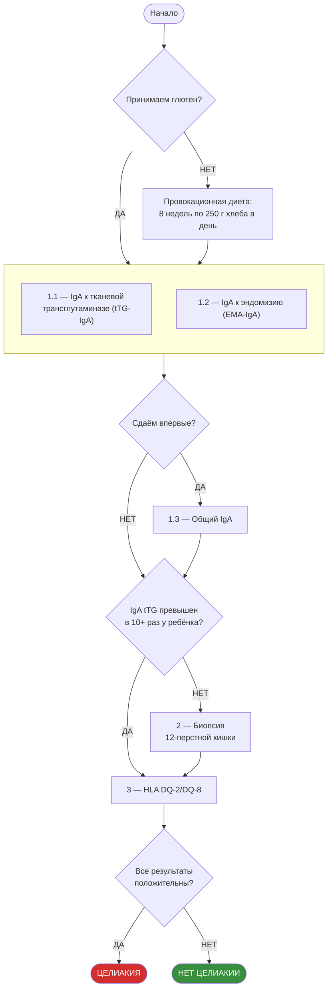

### Целиакия — диагностика

В данной статье я хочу подытожить знания по тактике диагностики целиакии, которые я узнал из [видео доктора Курстак](https://www.youtube.com/watch?v=qn1ThNpopGE) и из документа «[Всероссийский консенсус по диагностике и лечению целиакии у детей и взрослых](https://stopgluten.info/files/d9da91d41c33bfbcc9be22e8dce7570c.pdf)».

Очень рекомендую посмотреть видео и прочитать Консенсус, указанные в предыдущем абзаце.



Я не являюсь врачом или специалистом в медицине. По всем вопросам обращайтесь к профильным врачам — с целиакией это гастроэнтеролог. Информация приводится справочно.



#### Тесты

Для постановки диагноза целиакия необходимы следующие тесты:

1. Анализ крови на фоне приёма глютена (≥ 8 недель по 250 г хлеба в день):
    1. IgA к тканевой трансглутаминазе (tTG-IgA). Если превышен в 10 и более раз у ребёнка — целиакия. Если нет — сдаём п. 2 и п. 3.
    2. IgA к эндомизию (EMA-IgA).
    3. Если сдаём тесты впервые — общий IgA. При дефиците общего IgA тесты 1.1 и 1.2 могут быть неинформативны.
2. Биопсия двенадцатиперстной кишки на фоне приёма глютена.
3. Генетический анализ для определения наследственной предрасположенности HLA DQ-2/DQ-8. Одного этого анализа недостаточно, так как эти гены встречаются у 30–40% популяции, а целиакия развивается у 0,5–1%. Но в совокупности с п. 1 и п. 2 картина складывается.

Лечение целиакии — это полное исключение глютена из рациона.
Про продукты, содержащие скрытый глютен, можно почитать [здесь](silent_gluten.md).

То же самое попробовал изобразить на схеме:

#### Примечания

- **Анализы IgG** в общем случае неинформативны для диагностики целиакии — они лишь указывают на то, что организм встречался с глютеном. Исключение: при подтверждённом дефиците общего IgA используются тесты на дезамидированные пептиды глиадина (DGP IgA/IgG) или tTG-IgG — они информативны в этом случае.
- **Насчёт п. 3.** У примерно 5% больных целиакией нет DQ-2/DQ-8 — генетической предрасположенности. Читаю статью [Genetic and Environmental Contributors for Celiac Disease](https://link.springer.com/article/10.1007%2Fs11882-019-0871-5), уточню данные после прочтения.
- **Биопсия у взрослых обязательна.** Правило «10-кратного превышения tTG-IgA без биопсии» применяется только у детей (протокол ESPGHAN 2020). У взрослых биопсия двенадцатиперстной кишки остаётся обязательным этапом диагностики.
- Если целиакия не подтверждена, а реакция на глютен есть, это может быть аллергия на пшеницу или нецелиакийная чувствительность к глютену (NCGS) — не аутоиммунное и не аллергическое заболевание.
- [Практическое руководство Всемирной организации гастроэнтерологов (ВОГ-OMGE)](https://www.worldgastroenterology.org/UserFiles/file/guidelines/celiac-disease-russian-2005.pdf) — ещё один полезный источник.

Аллергия на пшеницу выражается в тех же симптомах, что и целиакия, но через часы после приёма глютена. При этом не зависит от дозы.
Для диагностики аллергии на пшеницу применяются:
- Прик-тесты
- Анализ на IgE к продуктам

Лечение аллергии:
- Полное исключение глютена из рациона
- Пищевой дневник (помогает выявить продукты со скрытым глютеном или другие аллергены)

Про продукты, содержащие скрытый глютен, можно почитать [здесь](silent_gluten.md).

Нецелиакийная чувствительность к глютену (NCGS) зависит от дозы глютена. Можно подобрать комфортную дозу и с ней жить.
