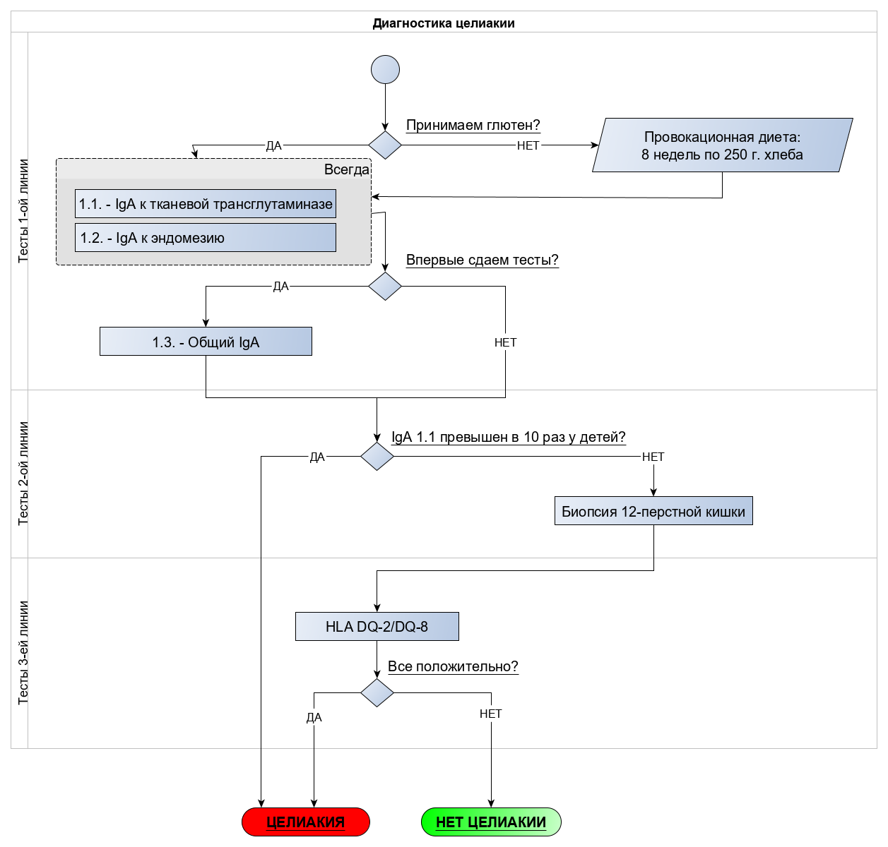

<!-- Yandex.Metrika counter -->

<noscript>

</noscript>
<!-- /Yandex.Metrika counter -->

### Целиакия - диагностика

В данное статье я хочу подытожить знания по тактике диагностики целиакии, которые я узнал из [видео доктора Курстак](https://www.youtube.com/watch?v=qn1ThNpopGE) и из документа "[Всероссийский консенсус по диагностике и лечению целиакии у детей и взрослых](https://stopgluten.info/files/d9da91d41c33bfbcc9be22e8dce7570c.pdf)".

Очень рекомендую посмотреть видео и прочитать Консенсус, указанные в предыдущем абзаце. И да, я не являюсь врачем или специалистом в медицине, поэтому по всем вопросам обращайтесь к профильным врачам. С целиакией - это гастроэнтеролог! Информация приводится справочно. Минздрав предупреждает, все такое.

#### Тесты
Для постановки диагноза Целиакия необходимы следующие тесты:
1. Анализ крови на фоне приема глютена (>= 8 недель по 250 г. хлеба):
    1. IgA к тканевой трансглутаминазе. Если превышен в 10 и более раз у ребенка, то целиакия. Если нет, то сдаем п.2 и п.3
    2. IgA к эндомезию
    3. Если впервые сдаем тесты, то общий IgA. В случае дефицита общего IgA может указывать, что тесты 1.1 и 1.2 не показательны
2. Биопсия 12-перстной кишки на фоне приема глютена
3. Генетический анализ для определения наследственной предраспололженности HLA DQ-2/DQ-8. Одного этого анализа не достаточно, так как эти гены встречаются у 30-40% популяции, а целиакия развивается у 0.5-1%. Но в совокупности с п.1 и п.2 картина складывается.

Лечение целиакии - это полное исключение глютена из рациона.
Про продукты, содержащие скрытый глютен, можно почитать [здесь](silent_gluten.md)

Тоже самое попробовал изобразить на схеме:

#### Примечания:
- Анализы IgG не информативны. Говорят лишь о том, что организм встречался с глютеном. Не более.
- Насчет п.3. У примерно 5% больных целиакией нет DQ-2/DQ-8 - генетической предраспололженности. В данный момент читаю статью [Genetic and Environmental Contributors for Celiac Disease](https://link.springer.com/article/10.1007%2Fs11882-019-0871-5), уточню данные после прочтения.
- Если целиакия не подтверждена, а реакция на глютен есть, это может быть аллергия на пшеницу или непереносимость глютена (не аутоиммуное и не аллергическое заболевание).

Аллергия на пшеницу выражается в тех же симптомах, что и целиакия, но через часы после приема глютена. При этом, не зависит от дозы.
Для диагностики аллергии на пшеницу применяются:
- Прик тесты
- Анализ на IgE на продукты
Лечение аллергии:
- Полное исключение глютена из рациона
- Пищевой дневник (хз зачем, видимо, чтобы найти продукты со скрытым глютеном или иные аллергены)
Про продукты, содержащие скрытый глютен, можно почитать [здесь](silent_gluten.md)

Непереносимость глютена зависит от дозы глютена. Можно подобрать комфортную дозу и с ней жить.
