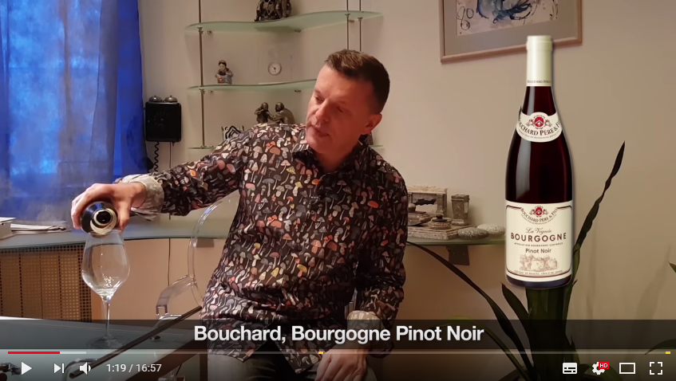

# Вино из Парфенона (18+)

<!-- Yandex.Metrika counter -->

<noscript>

</noscript>
<!-- /Yandex.Metrika counter -->

Список вин из видео-блога Леонида Парфенова ["Парфенон"](https://www.youtube.com/channel/UCbhMGG0ZievPtK8mzLH5jhQ). Названия кликабельны. Номера соответствуют выпускам.

1. [Bourgogne Pinot Noir La Vignee](https://simplewine.ru/catalog/product/bouchard_pere_fils_bourgogne_pinot_noir_la_vignee_2015_075/) + ссылка на [vivino](https://www.vivino.com/wineries/bouchard-pere-and-fils/wines/bouchard-pere-and-fils-la-vignee-bourgogne-pinot-noir-2015)
2. [Fausse Piste (производитель)]("http://www.faussepiste.com/ + ссылка на [vivino](https://www.vivino.com/wineries/fausse-piste/wines/fausse-piste-the-vegetable-lamb-uv?ref=navigation-search)
3. [Estate Pinot Noir (производитель)](https://hiddenbench.com/shop/estate-pinot-noir/) + ссылка на [vivino](https://www.vivino.com/wineries/hidden-bench/wines/hidden-bench-pinot-noir-2014)
4. Airen Pampaneo 2016 (ссылка не из выпуска на [vivino](https://www.vivino.com/wineries/ecologica-bruno-ruiz/wines/ecologica-bruno-ruiz-pampaneo-airen-natural-2016))
5. [Marques de Caceres Excellens Cuvee Especial Crianza](https://www.eurowine.ru/wine/6344/marques-de-caceres-excellens-cuvee-especial-crianza/) + ссылка на [vivino](https://www.vivino.com/wineries/marques-de-caceres/wines/marques-de-caceres-excellens-cuvee-especial-rioja-uv)
6. [Chianti Classico](https://www.eurowine.ru/wine/3618/chianti-classico/#i) + ссылка на [vivino](https://www.vivino.com/wineries/il-molino-di-grace/wines/il-molino-di-grace-chianti-classico-uv?ref=navigation-search)
7. [Barbera d'Alba](https://www.eurowine.ru/wine/3228/barbera-dalba/) + ссылка на [vivino](https://www.vivino.com/wineries/gianfranco-alessandria/wines/gianfranco-alessandria-barbera-d-alba-uv)
8. [Chateau Gassier Rose 946](https://www.eurowine.ru/wine/6527/chateau-gassier-rose-946/) + ссылка на [vivino](https://www.vivino.com/wineries/gassier/wines/gassier-chateau-gassier-946-sainte-victoire-selection-parcellaire-rose-uv?ref=navigation-search)
9. [Chablis Grand Cru Les Blanchots](https://www.eurowine.ru/wine/4516/chablis-grand-cru-les-blanchots/) + ссылка на [vivino](https://www.vivino.com/wineries/domaine-laroche/wines/domaine-laroche-chablis-grand-cru-les-blanchots-uv)

**Спецвыпуск "Русские евреи 1"**: Villa sandi il fresco&nbsp;(ссылка не из выпуска на [vivino](https://www.vivino.com/wineries/villa-sandi/wines/villa-sandi-prosecco-il-fresco-nv))

{:start = "10"}
10. Domaine Paul Pillot Bourgogne Pinot Noir, Бургундия, 2014 (ссылка не из выпуска на [vivino](https://www.vivino.com/wineries/azienda-agricola-gini-sandro-e-claudio/wines/azienda-agricola-gini-sandro-e-claudio-pinot-noir-bourgogne-2014))

**Спецвыпуск "Русские евреи 2"**: [Vitovska](https://simplewine.ru/catalog/product/vodopivec_vitovska_2012_075) + ссылка на [vivino](https://www.vivino.com/wineries/vodopivec/wines/vodopivec-vitovska-2012)

**Спецвыпуск "Русские евреи 3"**: Gravner Anfora Ribolla Gialla Venezia Giulia IGT + ссылка на [vivino](https://www.vivino.com/wineries/gravner/wines/gravner-anfora-ribolla-gialla-2001)

11. Arinzano Grand Vino, Наварра, 2010 + ссылка на [vivino](https://www.vivino.com/wineries/arinzano/wines/arinzano-gran-vino-blanco-2010)
12. [Askaneli Brothers Rkatsiteli Qvevri](https://l-wine.ru/collection/item/askaneli-brothers-rkatsiteli-qvevri--2516/) + ссылка на [vivino](https://www.vivino.com/wineries/ge-askaneli-brothers/wines/ge-askaneli-brothers-rkatsiteli-qvevri-uv)
13. [Chateau Cadet Bon Grand Cru](https://www.eurowine.ru/wine/6592/chateau-cadet-bon-grand-cru/#) + ссылка на [vivino](https://www.vivino.com/wineries/cadet-bon/wines/cadet-bon-saint-emilion-grand-cru-classe-uv)
14. 
    1. Fanagoria Cru Lermont Pinot Noir, 2016 + ссылка на [vivino](https://www.vivino.com/wineries/fanagoria/wines/cru-lermont-pinot-noir-2016)
    2. Villa Romanov Meotida Pinot Noir, Тамань, Голубицкая стрелка, 2016 + ссылка на [vivino](https://www.vivino.com/wineries/villa-romanov/wines/villa-romanov-meotida-pinot-noir-uv)

**Спецвыпуск "Цвет нации"**:  Saint-Joseph Rouge Lieu-dit, хозяйство E.Guigal, долина Роны, Франция, 2015 + ссылка на [vivino](http://www.vivino.com/wines/23127851)

**Первый прямой эфир**: Оранжевое вино [Chitinashvili](https://www.vivino.com/search/wines?q=Chitiashvili)

15. Arínzano Gran Vino Blanco, Испания 2014 + ссылка на [vivino](https://www.vivino.com/wineries/arinzano/wines/arinzano-gran-vino-blanco-2014)
16. Finca Altamira, провинция Мендоса, Аргентина, 2014, виноград мальбек 100% + ссылка на [vivino](https://www.vivino.com/wineries/arinzano/wines/arinzano-gran-vino-blanco-2014)
17. Ornellaia, Bolgheri Superiore DOC, 2011 + ссылка на 2010 год на [vivino](https://www.vivino.com/ornellaia-bolgheri-superiore/w/22447?price_id=627650&amp;year=2010)
18. DO-RE-MI, mtsvane, 2016 и DO-RE-MI, rkatsiteli, 2016 (ссылок не нашел)
19. Barbaresco Bricco Asili Bernardot DOCG, 2008 + ссылка на [vivino](https://www.vivino.com/ceretto-aziende-vitivinicole-srl-bricco-asili-barbaresco-bernadot/w/7138)

**Второй прямой эфир**: Португальское красное вино [Quinta de Saes](https://www.vivino.com/alvaro-castro-quinta-de-saes-reserva-estagio-prolongado/w/1161703)

20. Brunello di Montalcino Castelgiocondo, 2013 + ссылка на [vivino](https://www.vivino.com/it-castelgiocondo-brunello-di-montalcino/w/1098912)
21. Domaine des Varoilles Gevrey-Chambertin Clos du Meix Ouches Monopole, 2013 + ссылка на [vivino](https://www.vivino.com/domaine-des-varoilles-gevrey-chambertin-clos-du-meix-des-ouches/w/1164442?year=2013)
22. Chateauneuf-Du-Pape Télégramme 2016 + ссылка на [vivino](https://www.vivino.com/vieux-telegraphe-telegramme-chateauneuf-du-pape/w/77716?price_id=17367330&amp;year=2016)
23. Bourgogne Chardonnay 2016 Chantereves + ссылка на [vivino](https://www.vivino.com/chantereves-bourgogne-chardonnay/w/2740977)
24. Le Coste Litrozzo VdT, 2018 + ссылка на [vivino](https://www.vivino.com/it-le-coste-litrozzo-rosso/w/2269463)
25. Luce della Vite + ссылка на [vivino](https://www.vivino.com/luce-della-vite-luce/w/83594)
26. Achaval Ferrer, "Finca Mirador", Mendoza, 2013 + ссылка на [vivino](https://www.vivino.com/achaval-ferrer-finca-mirador-medrano-mendoza-red-wine/w/6137652)
27. Achaval Ferrer Finca Altamira, 2014 + ссылка на [vivino](https://www.vivino.com/achaval-ferrer-finca-altamira-malbec/w/1176258)
28. Mauro Molino, Barolo, 2014 + ссылка на [vivino](https://www.vivino.com/mauro-molino-barolo/w/100372?year=2014)

29. 
    1. Tenuta delle Terre Nere, Etna Rosso DOC, 2015 + ссылка на [vivino](https://www.vivino.com/tenuta-delle-terre-nere-etna-rosso/w/1225467)
    2. Benanti, Etna Rosso DOC, 2015 + ссылка на [vivino](https://www.vivino.com/benanti-etna-rosso/w/1758784)
    3. Graci Etna Rosso, 2016 + ссылка на [vivino](https://www.vivino.com/graci-etna-rosso/w/75659)
    4. Etna Rosso DOC Arcuria, 2015 + ссылка на [vivino](https://www.vivino.com/graci-arcuria-etna-rosso/w/2134507)  

30.  
    1. Chanterêves Bourgogne Pinot Noir, 2016 + ссылка на [vivino](https://www.vivino.com/chantereves-bourgogne-pinot-noir/w/2922322?year=2016)
    2. Girolamo Russo 'San Lorenzo' Etna Rosso, 2015 + ссылка на [vivino](https://www.vivino.com/girolamo-russo-san-lorenzo-etna-rosso/w/1217639?year=2015)
    3. Azienda Agricola Ciro Biondi Cisterna Fuori Etna DOC + ссылка на похожее на [vivino](https://www.vivino.com/azienda-agricola-sergio-arcuri-piu-vite-riserva/w/5529312)
    4. Benanti, «Serra della Contessa», Etna DOC Rosso, 2011 + ссылка на [vivino](https://www.vivino.com/benanti-serra-della-contessa-etna-rosso/w/15297)

31. Poderi Boscarelli Vino Nobile di Montepulciano 2015 + ссылка на похожее на [vivino](https://www.vivino.com/podere-boscarelli-vino-nobile-di-montepulciano-costa-grande/w/6835233?year=2015)  
32.   
    1. Ronco Severo Ribolla Gialla delle Venezie IGT, 2016 + ссылка на [vivino](https://www.vivino.com/ronco-severo-ribolla-gialla/w/3566460)
    2. Vigneto Altura Ansonaco dell' Isola del Giglio Toscana + ссылка на [vivino](https://www.vivino.com/vigneti-st-giorgia-serrone-vino-ansonaco-dell-isola-del-giglio-white-wine-v-jm4cj/w/5606418)
33. Pieropan, Amarone della Valpolicella DOCG, 2013 + ссылка на [vivino](https://www.vivino.com/pieropan-amarone-della-valpolicella/w/4398766)
34. Izadi Larrosa DOCa Rioja Bodegas Izadi, 2017 + ссылка на [vivino](https://www.vivino.com/izadi-rioja-larrosa/w/2211676)
35. Emilio Moro Malleolus, 2015 + ссылка на [vivino](https://www.vivino.com/emilio-moro-malleolus/w/11604?year=2015)

**Третий прямой эфир**: Грузинское оранжевое вино  [Iago's Wine Chinuri](https://www.vivino.com/iagos-iago-chinuri-unknown-v-0sr8p/w/5714269)
